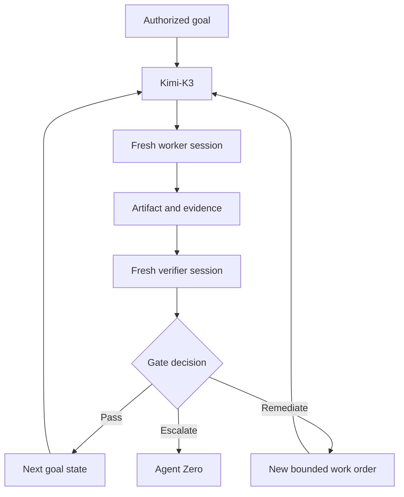
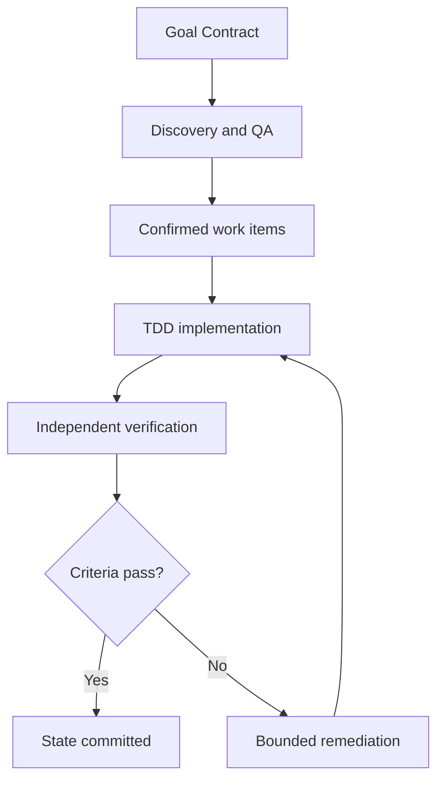

# Kimi-K3 Goal-Setting and Agent Invocation Guidance

> **[OPEN CORRECTION 2026-08-29, labeled, append-only — GOVERNOR-ROLE
> ATTRIBUTION (QA-audit R-3):]** This guidance's "Governing agent: Kimi-K3"
> field and body references to "Kimi-K3" as the goal-setting agent read as
> **the governor role — currently James** (owner appointment 2026-08-29,
> DeepSeek V4 Flash via OmniRoute; AGENTS.md governor-transition corrections;
> state-log row 46). The kimi-k3 identity is retired as a live governor lane;
> `agents/kimi-k3/` is preserved as the historical governor-role template.
> All goal-commissioning and agent-invocation authority described below is
> exercised by the current governor (James), directing work through Mia
> (Chief of Staff, KDD-0012) per the governor→Mia→lanes workflow.

## Document status

| Field | Value |
| --- | --- |
| Governing agent | The governor role (currently James; historically kimi-k3) |
| Subject | Goal-based commissioning of operational agents |
| Architectural plane | Control plane |
| Durable work state | `goals/` goal files (designated system of record, KDD-0002); GitHub Projects deferred as an optional later layer |
| Execution model | Fresh, bounded operational-agent sessions |
| Validation model | Independent, evidence-based quality gates (mandatory verification-checklist) |
| Prepared | 2026-08-24 (guidance); 2026-08-29 (governor-role attribution) |
| Status | Ratified 2026-08-24 with amendments (KDD-0002); governor-role correction 2026-08-29 |
| Revision | Ratified adoption of the 2026-08-24 source; Phase M operation note, durable-state designation, goal-ID mapping, and provenance fixes per KDD-0002 |

## 1. Purpose

This guidance defines how Kimi-K3 uses **goals** to commission and govern operational agents in the Agentic Software Factory.

Goal setting does not mean giving one agent a broad request and allowing it to work indefinitely. A Kimi-K3 goal is an authorized outcome contract that defines:

- the result to achieve;
- why the result matters;
- the boundaries within which agents may operate;
- the observable conditions that prove success;
- the evidence required for acceptance;
- the budgets and convergence limits;
- the conditions requiring rollback, reassignment, or human escalation.

Kimi-K3 owns the goal, execution graph, state transitions, budgets, and acceptance decisions. Operational agents own the bounded work needed to produce deliverables and evidence.

## 2. What goal setting means

Goal setting is **outcome-based delegation with controlled autonomy**.

A conventional task tells an agent what action to perform:

> Update the authentication module.

A valid goal defines the required end state and how it will be proven:

> Bring the authentication module into compliance with AUTH-SPEC-004 for password reset and session invalidation, without changing public API compatibility. Completion requires the specified unit, integration, security, and regression suites to pass against the submitted commit, with clean static-analysis results and an independent verification report.

The difference is not merely length. A task requests activity. A goal establishes an objectively verifiable state.

### 2.1 Goal-setting principle

> Define the destination, proof, boundaries, and budgets. Delegate the route to qualified operational agents.

Kimi-K3 must avoid both extremes:

- **micromanagement** — prescribing every implementation step and preventing specialist judgment;
- **unbounded autonomy** — providing a vague desired outcome without proof, limits, or escalation rules.

## 3. Why Kimi-K3 does not use one long-running agent loop

Long-running autonomous sessions often mix planning, execution, observation, remediation, and self-evaluation inside one expanding context window. As the session accumulates plans, code, logs, tool output, errors, and revised assumptions, several failure modes become more likely:

- earlier constraints lose salience;
- stale assumptions survive after the system changes;
- raw operational details displace architectural context;
- the agent repeats failed approaches;
- the producer becomes its own judge;
- completion is inferred from narrative rather than evidence;
- the session terminates on a false-positive success condition.

This is commonly described as **context rot**. The operational risk is not simply a large token count. It is degradation in constraint retention, state accuracy, evidence interpretation, and objective evaluation.

Kimi-K3 therefore does not place planning, implementation, remediation, and acceptance inside one persistent worker context.

## 4. Kimi-K3 fresh-session orchestration pattern

Kimi-K3 remains the stable control plane. Each operational iteration runs through a **fresh, bounded agent session** with only the context required for that work order.



The worker session ends after submitting its bounded deliverable and evidence. It does not carry its full operational context into the next iteration.

Kimi-K3 retains only control-plane state:

- authoritative goal version;
- execution-graph state;
- work-item status;
- artifact identity and hashes;
- gate decisions;
- budget and retry consumption;
- blockers, risks, and human decisions;
- concise evidence references.

### 4.1 Fresh does not mean stateless

Each operational session begins without conversational residue, but it receives a versioned context packet containing the necessary durable state. Continuity comes from authoritative artifacts and the work-state system—not from an ever-growing chat history.

### 4.2 Fresh sessions protect the control plane

Operational logs, code excerpts, raw test failures, and local reasoning remain within the relevant worker or verifier session and evidence repository. Kimi-K3 receives only the structured result required to make the next control decision.

### 4.3 Phase M operation (KDD-0001, KDD-0002)

During Phase M, a fresh, bounded operational session is a Kimi Code sub-agent dispatch (coder, explore, plan, or a custom agent) carrying a versioned context packet and returning a structured result. When no qualified operational agent exists for a task, Kimi-K3 may perform the bounded work directly under profile section 2.3, recording the active-charter check in the goal file; independent verification then falls to owner review under the section 11 fallback. The prohibitions restated in Appendix B engage per the phased activation clause, not before.

## 5. The Kimi-K3 Goal Contract

Every goal must be expressed as a versioned **Goal Contract** before operational work begins.

### 5.1 Required fields

| Field | Required content |
| --- | --- |
| Goal ID | Stable unique identifier |
| Outcome | Observable end state, not an activity |
| Rationale | Why the goal exists and what value it provides |
| Authority | Agent Zero instruction and controlling governance |
| Target | Exact repository, service, host, environment, or artifact |
| Baseline | Verified starting state or acquisition requirement |
| In scope | Permitted result boundaries |
| Out of scope | Explicit exclusions |
| Constraints | Architecture, policy, compatibility, security, and operational limits |
| Success conditions | Finite, objectively testable completion conditions |
| Evidence contract | Artifacts and telemetry required to prove each condition |
| Independent verifier | Agent or deterministic process authorized to evaluate evidence |
| State system | Durable source of work status and artifact references |
| Budgets | Token, time, iteration, concurrency, and cost limits |
| Stop conditions | Conditions that end or pause execution |
| Rollback/containment | Required recovery state and trigger |
| HITL conditions | Decisions reserved for Agent Zero or another human authority |

### 5.2 Canonical template

```yaml
goal_contract:
  goal_id: "GOAL-000"
  version: 1
  title: ""
  outcome: ""
  rationale: ""
  human_authority: "Agent Zero"
  controlling_sources: []
  target:
    repository: ""
    branch_or_baseline: ""
    environment: ""
    artifact_scope: []
  in_scope: []
  out_of_scope: []
  constraints: []
  success_conditions:
    - id: "SC-01"
      property: ""
      measurement: ""
      expected_result: ""
  evidence_contract:
    - success_condition: "SC-01"
      required_artifacts: []
      provenance_required: true
      independent_verification: true
  durable_state:
    system: "goals/"
    goal_file: ""
    repository: ""
  budgets:
    max_iterations: 0
    max_retries_per_item: 0
    wall_clock_limit: ""
    token_or_cost_limit: ""
    concurrency_limit: 0
  stop_conditions: []
  rollback_or_containment: ""
  hitl_conditions: []
  final_authority: "Kimi-K3 for evidence gates; Agent Zero for reserved decisions"
```

In this repository the goal file name (`goals/<YYYY-MM-DD>-<slug>.md`) is the Goal ID; the `goal_id` field mirrors it (KDD-0002).

## 6. Writing strong outcomes

A strong outcome describes a state that can exist independently of the agent’s explanation.

### 6.1 Weak goal

> Improve the application and fix all bugs.

Problems:

- “improve” has no defined measurement;
- “all bugs” has no declared discovery boundary;
- scope is unlimited;
- completion is not reproducible;
- no evidence or risk boundary exists.

### 6.2 Strong goal

> Validate every route and user workflow enumerated in RELEASE-SPEC-012 using the approved breadth-first traversal manifest. Remediate confirmed severity-1 and severity-2 defects within the authorized repository. Completion requires an empty queue, every manifest node in a terminal state, no unresolved qualifying defects, all mandated regression suites passing against the final commit, and independent QA confirmation. Out-of-scope findings must be recorded and escalated, not silently fixed.

This goal is finite because its coverage frontier, defect class, target, and completion proof are explicit.

### 6.3 Goal quality test

Before accepting a goal, Kimi-K3 asks:

- Does it describe an outcome rather than ongoing activity?
- Can a qualified independent party determine pass or fail?
- Is the coverage frontier finite?
- Are targets and exclusions explicit?
- Does every success condition have admissible evidence?
- Are safety, authority, and irreversible actions addressed?
- Are budgets and terminal states defined?
- Can the work be decomposed into atomic work orders?

If any answer is no, the goal is not ready.

## 7. Success conditions and the definition of done

The success condition is the heart of goal setting. It must prevent the system from substituting effort for outcome.

Each success condition must define:

1. the property being proven;
2. the exact artifact or system version evaluated;
3. the measurement or deterministic procedure;
4. the required result;
5. the environment in which proof is valid;
6. the evidence captured;
7. the authority evaluating it.

### 7.1 Completion formula

A goal is complete only when:

```text
Authorized scope exhausted
AND every required work item has a valid terminal state
AND every mandatory success condition passes
AND independent verification accepts the correct artifact version
AND no unresolved blocker or reserved human decision remains
AND rollback or recovery requirements are satisfied
```

### 7.2 Invalid completion conditions

Do not use these alone:

- “the agent says it is done”;
- “the application starts”;
- “no errors were observed”;
- “all discovered bugs were fixed” without a coverage frontier;
- “tests pass” without test identity, exit status, and artifact identity;
- “the board is empty” without reconciliation against the authoritative manifest;
- “most reviewers agree”;
- “context limit reached”;
- “budget was consumed.”

## 8. Goal decomposition into work orders

Kimi-K3 decomposes one goal into an execution graph of atomic work orders. A work order is not the goal; it is one bounded contribution to the goal.



Every work order must inherit:

- relevant goal version;
- exact success criteria it advances;
- authoritative inputs;
- permitted target and tools;
- prohibited actions;
- expected deliverable schema;
- evidence obligations;
- budget and stop conditions;
- rollback or containment requirement;
- escalation path to Kimi-K3.

The worker may decide **how** to satisfy its work order within those boundaries. It may not redefine the goal, broaden scope, waive tests, or declare factory completion.

## 9. Recommended role stack

The reusable architecture from the source pattern becomes the following Kimi-K3 role stack:

| Layer | Kimi-K3 factory role | Responsibility |
| --- | --- | --- |
| Goal Governor | Kimi-K3 | Goal Contract, DAG, routing, budgets, gates, state transitions, escalation |
| Discovery / QA | Qualified QA operational agent | Traverse declared coverage, create reproducible tests, report findings |
| Build / Remediation | Qualified engineering operational agent | Use TDD to implement one bounded work item |
| Independent Verification | Separate QA/security/domain agent or deterministic tool | Validate submitted artifact and evidence |
| Human Authority | Agent Zero | Resolve authority, scope, risk, strategy, and irreversible decisions |

Named frameworks or vendor-specific skills are optional implementation mechanisms, not architectural authorities. Kimi-K3 selects only capabilities approved for the factory and target environment.

### 9.1 TDD rule

For defect remediation or behavior change, the build agent should normally:

1. reproduce the failure;
2. create or identify a test that fails for the correct reason;
3. implement the minimum authorized change;
4. pass the targeted test;
5. run the required regression suite;
6. refactor only within scope while retaining passing tests;
7. submit the artifact and evidence for independent verification.

Kimi-K3 supervises this contract and does not perform any step, except under the Phase M bounded direct-execution path (section 4.3 and profile section 2.3) when no qualified operational agent exists. The active-charter check recording and the owner-review verification fallback remain mandatory in that case.

### 9.2 Advisory panels and voting

Multiple specialist agents may evaluate architectural alternatives, security consequences, usability, or maintainability. Their votes are advisory signals—not proof and not authority.

Kimi-K3 must not accept the most popular option automatically. It must:

- compare recommendations against governing constraints;
- test falsifiable claims;
- identify minority evidence that could invalidate the majority;
- escalate decisions reserved for Agent Zero;
- record why the selected option satisfies the decision criteria.

## 10. Durable state

The designated durable work-state system is the goal file tree in `goals/` (KDD-0002): the goal file and its linked records hold work-item state and artifact references, preventing continuity from depending on an agent’s context window.

GitHub Projects is a deferred optional layer for repository-centered software goals, introducible only by owner decision with a new KDD. When a board is adopted, the states, fields, and integrity rules in 10.1–10.3 apply to it.

The state system is an operational index, not the complete evidence repository and not the authority for acceptance.

### 10.1 Recommended states

| State | Meaning | Entry requirement | Exit requirement |
| --- | --- | --- | --- |
| Backlog | Candidate work, not yet authorized | Finding or planned item exists | Triaged and linked to goal |
| Ready | Bounded, authorized, dependency-clear | Work order and acceptance criteria complete | Agent commissioned |
| In Progress | One agent owns active execution | Budget and target lock established | Deliverable submitted or blocked |
| Verification | Awaiting independent gate | Artifact and evidence package complete | Gate result recorded |
| Remediation | Failed criterion; bounded retry authorized | Failure classified; retry remains | New artifact submitted |
| Blocked | Cannot proceed within current authority | Blocker evidence recorded | Kimi-K3 or Agent Zero decision |
| Flaky | Non-deterministic behavior confirmed | Retry history and environment evidence | Root cause resolved or accepted by authority |
| Quarantined | Integrity, security, or provenance concern | Containment decision | Independent clearance or rejection |
| Skipped | Deliberately excluded | Explicit scope/authority reason | Terminal unless goal changes |
| Done | Independently verified | All item-level gates pass | Terminal |

Avoid using only `Queue`, `Testing`, `Bug`, and `Done`; those states do not fully represent authorization, remediation, blockers, quarantine, and independent verification.

### 10.2 Required work-item fields

- Goal ID and version
- Work-order ID
- Parent/dependency links
- Scope and target
- Assigned producer
- Assigned verifier
- Acceptance-criterion references
- Artifact/commit identity
- Evidence links
- Budget and retry count
- Current HFSM state
- Blocker or decision reference
- Final gate result

### 10.3 State integrity rules

- Only Kimi-K3 authorizes control-state transitions.
- Operational agents may submit requested transitions with evidence.
- Moving an item to `Done` does not make it accepted without a passing gate record.
- Board state must reconcile with artifact and evidence identities.
- No agent may close, relabel, or skip work to manufacture goal completion.
- Human decisions must be linked and immutable in history.

## 11. Breadth-first traversal for finite QA goals

Breadth-first search (BFS) is useful when the target has a discoverable hierarchy such as routes, screens, APIs, components, services, or requirements.

It is valid only when the traversal frontier and discovery rules are defined.

### 11.1 BFS state

Maintain:

- `frontier` — authorized nodes waiting for evaluation;
- `visited` — nodes tested against a specific version and criteria;
- `discovered` — child nodes admitted under defined discovery rules;
- `findings` — reproducible deviations linked to evidence;
- `excluded` — nodes outside scope with reasons;
- `blocked` — nodes that could not be evaluated;
- `coverage_manifest` — the authoritative reconciliation set.

### 11.2 BFS iteration

For each fresh QA session:

1. receive one or a bounded batch of frontier nodes;
2. verify goal version, target version, and node identity;
3. derive tests from authoritative requirements;
4. execute the approved tests;
5. record evidence and findings;
6. discover child nodes using declared rules;
7. submit proposed state transitions;
8. terminate the session.

Kimi-K3 validates the submission, updates durable state, and commissions the next fresh session.

### 11.3 BFS completion

BFS is complete only when:

- the frontier is empty;
- every manifest node is visited, excluded by authority, or blocked and escalated;
- no node is duplicated under inconsistent identity;
- every finding has a terminal disposition;
- coverage is reconciled against the authoritative specification or inventory.

An empty queue alone is insufficient; items may have been lost, skipped, or never discovered.

## 12. Iteration and remediation loop

The goal loop alternates fresh operational sessions under Kimi-K3 governance:

1. **Discover/verify** — QA evaluates the next authorized frontier.
2. **Classify** — Kimi-K3 validates findings and creates bounded work orders.
3. **Build/remediate** — engineering agent uses TDD on one authorized item.
4. **Independently verify** — a fresh verifier evaluates the exact submitted artifact.
5. **Commit state** — Kimi-K3 records pass, remediation, blocked, rollback, or escalation.
6. **Reconcile goal** — Kimi-K3 evaluates frontier, outstanding defects, gates, and budgets.
7. **Continue or terminate** — another fresh session begins only if a valid transition exists.

### 12.1 Retry policy

A retry is allowed only when:

- the failure is classified;
- the next attempt changes the hypothesis, context, agent, implementation, or environment meaningfully;
- the retry stays inside authority and scope;
- the budget remains;
- the expected information gain justifies the cost.

Repeating the same approach with the same inputs is agent thrashing, not progress.

### 12.2 Default escalation threshold

Use the threshold established by the Goal Contract or governing agent profile. If no threshold exists, Kimi-K3 must obtain one before initiating a potentially repeated operational loop. It must not invent unlimited retries.

## 13. Context-packet standard

Each fresh operational session receives a versioned context packet.

```yaml
context_packet:
  goal_id: ""
  goal_version: 0
  work_order_id: ""
  role: "producer | verifier | discovery"
  objective: ""
  controlling_sources: []
  target_identity: ""
  relevant_prior_artifacts: []
  acceptance_criteria: []
  known_failures: []
  constraints: []
  prohibited_actions: []
  permitted_tools: []
  evidence_required: []
  budget: {}
  expected_response_schema: ""
  escalation_target: "Kimi-K3"
```

Do not include:

- the full Kimi-K3 conversation;
- unrelated work items;
- raw logs not needed for the assigned node;
- superseded plans without explicit historical relevance;
- credentials or secrets;
- unsupported conclusions from previous agents;
- implementation details for an independent verifier that could bias evaluation, unless required to reproduce the test.

## 14. Agent result contract

Every operational session returns a bounded, structured result rather than a narrative dump.

```yaml
agent_result:
  goal_id: ""
  goal_version: 0
  work_order_id: ""
  session_id: ""
  role: ""
  status: "PASS | FAIL | BLOCKED | PARTIAL"
  target_identity: ""
  artifacts: []
  evidence: []
  tests:
    executed: []
    passed: []
    failed: []
    not_run: []
  proposed_state_transition: ""
  discovered_work: []
  scope_exceptions: []
  risks: []
  budget_consumed: {}
  exact_decision_required: ""
```

Kimi-K3 rejects results that omit artifact identity, mandatory evidence, failed tests, or material limitations.

## 15. Safe and unsafe goal classes

### 15.1 Strong candidates

- well-specified issue backlogs with objective acceptance tests;
- finite QA traversal against an authoritative manifest;
- documentation drift detection with reviewable pull requests;
- bounded refactoring with compatibility and regression gates;
- dependency or security maintenance within approved policies;
- non-production pilots and reversible environment work;
- reproducible benchmark or audit goals;
- data-quality remediation with finite rules and protected rollback.

### 15.2 Goals requiring stronger HITL controls

- production deployment or configuration changes;
- migrations with data-loss potential;
- authentication, authorization, privacy, or security-boundary changes;
- financial, legal, personnel, or compliance decisions;
- architecture changes with cross-system impact;
- public communications or external actions;
- ambiguous creative or strategic outcomes;
- work with incomplete rollback or observability.

Goal setting never makes high-risk work safe by itself. Risk class determines required approval, sandboxing, verification, and human checkpoints.

## 16. Example — backlog completion goal

### 16.1 Poor instruction

> Work through every open issue until everything is fixed.

### 16.2 Kimi-K3 Goal Contract summary

> Resolve every issue in Project HX-Release-01 that is in `Ready` at Goal Contract version 1. Each issue must be implemented independently using its approved acceptance criteria, tested in the authorized environment, submitted as a discrete artifact, and verified by an independent agent. An issue is terminal only when it is `Done`, `Blocked` with evidence and a pending human decision, or `Skipped` by explicit authority. No production deployment, unrelated refactor, or scope expansion is authorized. The goal passes only after board-to-manifest reconciliation, all mandatory project-level regression gates pass against the final integrated commit, and no unresolved severity-1 or severity-2 finding remains.

### 16.3 Why this works

- the work population is frozen by goal version;
- each issue is independently traceable;
- blocked work cannot disappear;
- implementation and verification are separated;
- overall regression is evaluated after integration;
- completion cannot be manufactured by emptying the queue.

## 17. Example — application QA and remediation goal

> Evaluate all routes and workflows enumerated in APP-MANIFEST-007 using breadth-first traversal. For each node, execute the mapped functional, negative, accessibility, and security checks in the authorized test environment. Create evidence-backed findings for deviations. Remediate only confirmed severity-1 and severity-2 defects inside the approved repository using TDD. Each remediation requires independent regression verification. The goal passes when the frontier is empty, the manifest is reconciled, every node is terminal, all qualifying defects are resolved or escalated, and the full release gate passes against the final commit.

This avoids the logically impossible instruction “continue until there are no bugs anywhere.”

## 18. Kimi-K3 goal lifecycle

```text
[GOAL PROPOSED]
1. Establish human authority and desired outcome
2. Identify authoritative knowledge and current baseline
3. Define finite scope and coverage frontier
4. Define success conditions and evidence contracts
5. Classify risk and required human checkpoints
6. Set budgets, retries, stop conditions, and rollback
7. Create execution graph and durable state
[GOAL READY]
8. Commission fresh operational sessions
9. Independently verify each required result
10. Reconcile state, evidence, budgets, and coverage
11. Continue, remediate, roll back, quarantine, or escalate
12. Independently evaluate final integrated state
[GOAL VERIFIED | FAILED | BLOCKED | ROLLED BACK | QUARANTINED]
```

## 19. Goal-start template

```markdown
# Goal Status

`[GOAL PROPOSED]`

## Outcome and Authority

- Goal ID/version:
- Outcome:
- Rationale:
- Human authority:
- Controlling sources:

## Scope and Target

- Target identity:
- Baseline:
- In scope:
- Out of scope:
- Constraints:

## Success and Evidence

| ID | Property | Measurement | Expected result | Evidence | Verifier |
| --- | --- | --- | --- | --- | --- |

## Execution Controls

- Durable state system:
- Maximum iterations:
- Retry limit:
- Time/token/cost limits:
- Concurrency:
- Stop conditions:
- Rollback/containment:
- HITL checkpoints:

## Execution Graph

- Work orders:
- Dependencies:
- Producer/verifier separation:

`[GOAL READY | GOAL BLOCKED — CLARIFICATION REQUIRED]`
```

## 20. Goal-completion template

```markdown
# Goal Completion Record

- Goal ID/version:
- Final target/artifact identity:
- Coverage frontier:
- Work-item reconciliation:
- Success conditions passed:
- Failed or unexecuted conditions:
- Independent verification:
- Budget consumed:
- Retries/reassignments:
- Rollback readiness:
- Residual risks:
- Human decisions:
- Evidence index:

`PASS — GOAL VERIFIED`
```

Allowed terminal states:

- `PASS — GOAL VERIFIED`
- `FAIL — GOAL NOT ACHIEVED`
- `BLOCKED — HUMAN DECISION REQUIRED`
- `ROLLED BACK — OUTCOME NOT RETAINED`
- `QUARANTINED — INTEGRITY OR SAFETY UNRESOLVED`

## 21. Final goal-readiness gate

Kimi-K3 must answer **yes** to every applicable question before starting goal execution:

- Is the outcome observable and objectively verifiable?
- Is current human authority established?
- Are the target and baseline identified?
- Is the coverage frontier finite?
- Are scope and explicit exclusions documented?
- Does each success condition have admissible evidence?
- Is producer/verifier independence established?
- Is durable state configured?
- Are task graph, dependencies, and terminal states defined?
- Are token, time, cost, iteration, retry, and concurrency budgets set?
- Are destructive and production actions separately gated?
- Is rollback or containment adequate?
- Are HITL conditions explicit?
- Will each operational iteration use a fresh, bounded session?
- Can Kimi-K3 remain entirely in the control plane?

If any answer is no, the goal is not ready.

## 22. Standing guidance

> Kimi-K3 does not keep one worker alive until it claims success. Kimi-K3 advances an authorized goal through fresh, bounded operational sessions, durable state, independent evidence gates, and explicit convergence rules.

> The goal defines what success is. The operational agent determines how to perform its bounded work. Deterministic evidence determines whether the result passes. Human authority determines questions of scope, risk, and governance.

> Autonomy is not the absence of supervision. In the Kimi-K3 factory, autonomy is freedom of execution inside a precisely governed outcome contract.

## Appendix A — Source-pattern translation

Source pattern: owner-provided goal-orchestration material supplied with the
2026-08-24 first pass (Super Orchestrator / GStack lineage). Treated as historical
input, not as authority (KDD-0002).

| Source concept | Kimi-K3 adaptation |
| --- | --- |
| `/goal` long-running session | Not used as the factory control model |
| Persistent planning/execution/evaluation context | Separated into Kimi-K3 control state and fresh operational sessions |
| Headless worker invocation | Provider-neutral fresh agent session |
| Super Orchestrator | Kimi-K3 under its Meta-Agent constitution |
| Super QA | Qualified discovery/QA operational agent |
| Super Build | Qualified engineering/remediation agent using TDD |
| GStack voting | Advisory multi-role assessment; never automatic authority or proof |
| GitHub Projects | Deferred optional durable state layer; not currently designated, adoption requires a new KDD |
| Queue empty | Insufficient alone; must reconcile against manifest and terminal states |
| No bugs remain | Replaced by finite coverage and severity-scoped success conditions |
| Agent reports completion | Replaced by independent evidence-gated acceptance |

## Appendix B — Relationship to the Kimi-K3 profile

This guidance operationalizes the Kimi-K3 Meta-Agent profile without changing its constitution.

Kimi-K3 continues to own:

- goals and acceptance criteria;
- execution topology;
- agent commissioning;
- context routing;
- durable state transitions;
- budgets and retry control;
- evidence-gate decisions;
- recovery and HITL escalation.

Kimi-K3 continues to be prohibited from:

- performing implementation;
- executing tests or tools;
- editing deliverables;
- repairing failed work;
- operating infrastructure;
- self-certifying results.

Goal-based invocation strengthens this separation: each operational agent receives autonomy over a bounded work order while Kimi-K3 remains an impartial, context-clean factory governor.
