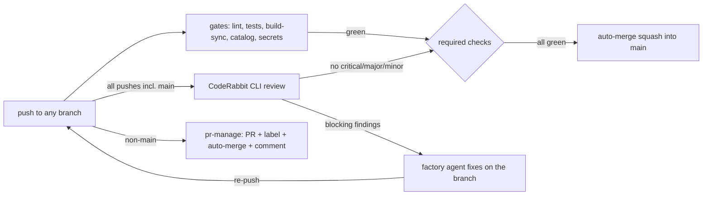

# CI/CD pipeline — HX-ASF-Servers

Owner-ratified 2026-08-26 (p8, plan `argent-groot-ant-man`). Trigger: **every push to
any branch**. 18 steps across three jobs. Happy path (push to `main`, gates only)
completes in about 3 minutes.

The pipeline's own gates are the repo's existing quality discipline — the same
commands the factory runs locally. CodeRabbit supplies the automated review gate on
all pushes (incl. main); the **factory agent applies fixes** (CodeRabbit's own
supported loop: it detects, the coding agent fixes, ≤2 passes); GitHub platform
auto-merge merges when the required checks are green. No manual approval gates
anywhere.

## Step list (18)

**Job `gates`** — all pushes:

1. Checkout (full history, for the secret-scan range).
2. Set up Python 3.12.
3. Lint — byte-compile all Python (`compileall scripts` + fixtures).
4. Lint — `shellcheck scripts/hooks/*.sh`.
5. Unit tests — fixtures regression suite (`fixtures/test_fixtures.py`).
6. Unit tests — wiki renderer suite (`scripts/wiki/test_render.py`).
7. Build validation — wiki HTML in sync (`scripts/wiki/render.py --check`).
8. Catalog validation (`scripts/validate.py --ci` — portable mode: every catalog
   check runs, except CAT-07's canonical_location *existence* probe, which is
   anchored to the governor host by design — repo home plus `/opt/tkv-local` —
   and stays a local-only check in the full mode).
9. Security scan — gitleaks over the pushed commit range, redacted.

**Job `coderabbit-review`** — ALL pushes incl. main (owner directive 2026-08-28:
"coderabbit should run on every commit regardless of the type"):

10. Checkout (full history for the base diff).
11. Install the CodeRabbit CLI.
12. Review: main pushes review the pushed range `BEFORE..HEAD`; branch pushes
    review vs `origin/main` — `coderabbit review --agent --light --committed`
    (main) / `--base origin/main` (branches) with the Agentic API key — skips
    with a notice when `CODERABBIT_API_KEY` is not configured.
13. Parse the JSON event stream; the gate **fails on critical+major+minor
    findings (zero-tolerance, owner directive 2026-08-28)** and on any review
    that ends without a `complete` event (fail-closed on auth/service failure);
    trivial/info findings are reported, not blocking.
14. Comment the review summary on the PR.

**Job `pr-manage`** — non-`main` pushes only (runs regardless of other jobs, so the
PR always exists for the fix loop):

15. Ensure a PR exists for the branch (create targeting `main` on first push).
16. Auto-label by branch prefix (`feature/`, `fix/`, `chore/`; labels auto-created).
17. Enable auto-merge (squash) on the PR.
18. Comment the pipeline state on the PR (notification surface).

## Lifecycle

## The review-fix loop

CodeRabbit CLI reviews the pushed range (main) or the branch diff against `main`
and emits structured findings. Blocking findings (critical/major/minor —
zero-tolerance per owner directive 2026-08-28) fail the `coderabbit-review` check,
which blocks auto-merge. The factory agent (current fixing agent per the roster;
governor retains review authority) reads the findings, fixes on the same branch,
and re-pushes — the pipeline re-runs automatically. Loop limit per CodeRabbit's
own guidance: ≤2 review passes on the same change; remaining nits are ignored
deliberately. A run that produces no `complete` event (CLI/auth/service failure)
fails the gate loudly rather than passing silently.

## Conventions

- Branches: `feature/<slug>`, `fix/<slug>`, `chore/<slug>` — anything else is
  legal but unlabeled. `main` is the factory's working branch; protection requires
  the two checks **for PRs only** — direct pushes by the governor stay possible.
- PRs: auto-created on first push, auto-labeled by prefix, squash auto-merged when
  green. Bot/CI commits carry no co-author (repository rule).
- Notifications: GitHub PR comments + check statuses (p8 default channel).

## Setup (one-time)

Owner (web):

1. Create/confirm a CodeRabbit organization with an **assigned seat** (the headless
   API-key flow requires one; plan allowance is used first, usage-based add-on for
   over-limit). US region is the default (`--region eu` for EU accounts).
2. Generate an **Agentic API key** (app.coderabbit.ai → Settings → API Keys).
3. Add it as repo secret **`CODERABBIT_API_KEY`** (GitHub → repo → Settings →
   Secrets and variables → Actions). The workflow also accepts a
   `CODERABBIT_API_KEY_2` fallback name (the repo currently carries the key
   under that name, 2026-08-26).
4. Optional: install the CodeRabbit GitHub App for PR-native review threads and
   Autofix (`.coderabbit.yaml` already carries `request_changes_workflow` and
   `finishing_touches.autofix` for that day; Autofix needs a Pro plan).

Bootstrap (already executed via API with the classic PAT; documented here):

- `allow_auto_merge: true` on the repo.
- Actions workflow permissions: write + allow Actions to create/approve PRs.
- Branch protection on `main`: required checks `gates` and `coderabbit-review`
  (PR merges only; no required reviews; admins not restricted — the factory's
  governor-on-main flow is preserved).

Note: the fine-grained PAT in the local credential store returned 401 on
2026-08-26 — revoke/replace it; the classic PAT works.

## Deviations from the p8 letter (ratified with the plan)

- D1: Fix commits are made by the factory agent, not by CodeRabbit — CodeRabbit's
  current CLI does not commit fixes; its supported loop is "detect → agent fixes →
  re-review, ≤2 passes". (The App's Autofix can commit, but needs App + Pro plan.)
- D2: "<10 min happy path" holds for `main` pushes (gates only, ≈3 min). The
  branch review gate takes 7–30+ min by CodeRabbit's own numbers; `--light`
  policy trims it. Review gates merge, not push feedback.
- D3: "CodeRabbit approves and merges" = green review check + GitHub platform
  auto-merge. No App-approval dependency.
- D4: Security scan is gitleaks (this repo's real risk class is credential leaks;
  there are no dependency manifests, so Dependabot does not apply). CodeQL stays
  available free (public repo) as a later addition.

## Second Brain evaluation (standing directive)

1. Opportunity identified: **yes** — pipeline runs and their outcomes are
   catalogable evidence (CI as a governance signal: which changes passed which
   gates, when, with which findings).
2. Roadmap capability/pattern: run receipts feeding the Second Brain catalog —
   the same evidence discipline the pilots already use, extended to CI.
3. Disposition: **recommended for a future iteration, not implemented now** —
   adding catalog writes to the pipeline today would expand scope beyond the
   ratified plan.
4. Evidence/reasoning: recorded here per the standing directive; revisit when the
   pipeline has a month of run history to catalog against.

## Amendment log — labeled corrections (append-only)

[OPEN CORRECTION 2026-08-28, labeled, append-only: the workflow file
`.github/workflows/ci-cd.yml` was amended on 2026-08-28 with three changes
that supersede the text above. The original 2026-08-26 text is preserved
as history; THIS correction block is the current reading.]

1. **Trigger** — the `coderabbit-review` job now runs on **ALL pushes
   including `main`** (owner directive 2026-08-28: "coderabbit should
   run on every commit regardless of the type"). The doc above says
   "non-`main` pushes only" (§Step list, step 10 header; §Lifecycle
   diagram; §Review-fix loop) — that wording is STALE. Main pushes
   review the pushed range `BEFORE..HEAD`; branch pushes review vs
   `origin/main`.

2. **Blocking threshold** — the gate now blocks on **ALL findings:
   critical + major + minor** (owner directive 2026-08-28: "we are
   introducing problems in our codebase that coderabbit can find and
   fix" — zero-tolerance, not severity triage). The doc above says
   "fails on critical/major findings" and "minor/trivial findings are
   reported, not blocking" (§Step list, step 13; §Review-fix loop) —
   that wording is STALE. Trivial and info findings remain non-blocking.

3. **Fix-loop agent** — the doc references "Kimi-K3 / john" as the
   factory agent (§Review-fix loop). The governor role is now held by
   **Flash** (owner appointment 2026-08-29); the fix-loop agent is
   whoever the governor dispatches under a work order — typically
   routed through Mia to the appropriate engineering lane. The
   "Kimi-K3 / john" wording is STALE.

[ADDENDUM 2026-08-29, labeled, append-only: the three corrections above are
now APPLIED to the document body — the `coderabbit-review` job (§Step list,
§Lifecycle, §Review-fix loop) reads "ALL pushes incl. main", the blocking
threshold reads "critical+major+minor (zero-tolerance)", and the fix-loop
agent reference no longer names "Kimi-K3 / john". The 2026-08-28 amendment
text above is preserved as history; the body is the current reading.]
