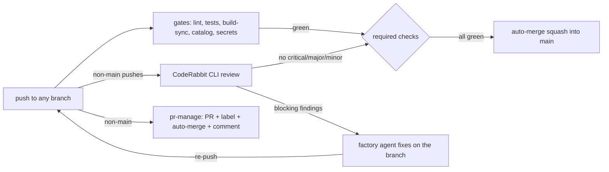

# CI/CD pipeline — HX-ASF-Servers

Owner-ratified 2026-08-26 (p8, plan `argent-groot-ant-man`). Trigger: **every push to
any branch**. 20 steps across three jobs. Happy path (push to `main`, gates only)
completes in about 3 minutes.

The pipeline's own gates are the repo's existing quality discipline — the same
commands the factory runs locally. CodeRabbit supplies the automated review gate on
feature-branch/PR validation (owner directive 2026-08-30 supersedes running it on
post-merge `main` pushes — the merged commit was already reviewed as part of the
PR); the **factory agent applies fixes** (CodeRabbit's own
supported loop: it detects, the coding agent fixes, ≤2 passes); GitHub platform
auto-merge merges when the required checks are green. No manual approval gates
anywhere.

## Step list (20)

**Job `gates`** — all pushes:

1. Checkout (full history, for the secret-scan range).
2. Set up Python 3.12.
3. Lint — byte-compile all Python (`compileall scripts` + fixtures).
4. Lint — `shellcheck scripts/hooks/*.sh`.
5. Unit tests — fixtures regression suite (`fixtures/test_fixtures.py`).
6. Unit tests — wiki renderer suite (`scripts/wiki/test_render.py`).
7. Build validation — wiki HTML in sync (`scripts/wiki/render.py --check`).
8. Install PyYAML (`validate.py` dependency).
9. Unit tests — work-state engine (`scripts/test_work_state.py`, O1). Ordered
   after the PyYAML install because `work_state.py` imports `yaml`.
10. Catalog validation (`scripts/validate.py --ci` — portable mode: every catalog
   check runs, except CAT-07's canonical_location *existence* probe, which is
   anchored to the governor host by design — repo home plus `/opt/tkv-local` —
   and stays a local-only check in the full mode).
11. Security scan — gitleaks over the pushed commit range, redacted.
   [OPEN CORRECTION 2026-08-30, labeled: the scan above is now pinned to
   `v8.30.1` (immutable version AND a pinned archive SHA-256, verified
   against the official `checksums.txt` 2026-08-30 — supply-chain hardening;
   the digest and its comment are updated together). Prior behavior: latest
   tag resolved at run time. Current behavior: pinned version + verified
   digest. Original wording preserved above.]

**Job `coderabbit-review`** — feature-branch/PR pushes only (owner directive
2026-08-30 supersedes the prior all-pushes-incl.-main scope — see amendment log; a
post-merge re-review of the merged commit produced a red run after a completed
merge):

12. Checkout (full history for the base diff).
13. Install the CodeRabbit CLI.
14. Review: the job reviews the **pushed range** — `coderabbit review --agent
    --light --committed --base-commit <BEFORE>` with the Agentic API key and an
    explicit `--region` for inline api-key authentication. `--base origin/main`
    is the **fallback**, used only when `BEFORE` is empty, all-zeros,
    unresolvable, or not an ancestor of `HEAD` (force-push). A review that ends
    with no `complete` event is retried up to 3 times with backoff — the
    service-provided `waitTime` on a recoverable rate limit (capped at 780s),
    otherwise a fixed `attempt × 30s` transport backoff. The job is fail-closed
    on a missing `CODERABBIT_API_KEY`.
    [OPEN CORRECTION 2026-08-30, labeled: CodeRabbit is a required check — a
    missing `CODERABBIT_API_KEY` now FAILS the job (cannot pass vacuously).
    Prior behavior: skip with a notice. Current behavior: fail closed. Original
    wording preserved above.]
15. Parse the JSON event stream; the gate **fails on critical+major+minor
    findings (zero-tolerance, owner directive 2026-08-28)** and on any review
    that ends without a `complete` event (fail-closed on auth/service failure);
    trivial/info findings are reported, not blocking.
16. Comment the review summary on the PR.

**Job `pr-manage`** — non-`main` pushes only (runs regardless of other jobs, so the
PR always exists for the fix loop):

17. Ensure a PR exists for the branch (create targeting `main` on first push).

**Permissions** — the workflow defaults to `contents: read` + `pull-requests:
read`; only the `pr-manage` job escalates to write (auto-PR/label/merge),
hardening per Codex audit 2026-08-30. A separate scheduled workflow
(`full-history-secret-scan.yml`, weekly + manual) runs gitleaks over **all
history** so pre-existing leaked credentials surface for owner triage
(no auto-rewrite).
18. Auto-label by branch prefix (`feature/`, `fix/`, `chore/`; labels auto-created).
19. Enable auto-merge (squash) on the PR.
20. Comment the pipeline state on the PR (notification surface).

## Lifecycle

## The review-fix loop

CodeRabbit CLI reviews the pushed range `BEFORE..HEAD` (feature-branch/PR
validation only; the job skips post-merge `main` pushes), falling back to the
branch diff against `origin/main` only when `BEFORE` is unusable,
and emits structured findings. Blocking findings (critical/major/minor —
zero-tolerance per owner directive 2026-08-28) fail the `coderabbit-review` check,
which blocks auto-merge. The factory agent (current fixing agent per the roster;
governor retains review authority) reads the findings, fixes on the same branch,
and re-pushes — the pipeline re-runs automatically. Loop limit per CodeRabbit's
own guidance: ≤2 review passes on the same change; remaining nits are ignored
deliberately. A run that produces no `complete` event (CLI/auth/service failure)
fails the gate loudly rather than passing silently, and is reported as
UNREACHABLE — distinct from "the code has findings" — in both the error
annotation and the step summary. One deliberate exception: when every file in
the range is excluded by `.coderabbit.yaml` `path_filters` (e.g. a
generated-only HTML re-render) the service returns "No files to review" and the
gate passes vacuously, because nothing was in scope to review.

## Conventions

- Branches: `feature/<slug>`, `fix/<slug>`, `chore/<slug>` — anything else is
  legal but unlabeled. `main` is the factory's working branch; protection requires
  the two checks **for PRs only** — direct pushes by the governor stay possible.
- PRs: auto-created on first push, auto-labeled by prefix, squash auto-merged when
  green. Bot/CI commits carry no co-author (repository rule).
- Notifications: GitHub PR comments + check statuses (p8 default channel).

## Setup (one-time)

Owner (web):

1. Create/confirm a CodeRabbit organization with an **assigned seat** (the headless
   API-key flow requires one; plan allowance is used first, usage-based add-on for
   over-limit). The workflow passes `--region` explicitly for inline api-key
   auth, defaulting to `us` (account region verified US, 2026-08-30); set the
   repo variable `CODERABBIT_REGION` if the org moves region.
2. Generate an **Agentic API key** (app.coderabbit.ai → Settings → API Keys).
3. Add it as repo secret **`CODERABBIT_API_KEY`** (GitHub → repo → Settings →
   Secrets and variables → Actions). The workflow also accepts a
   `CODERABBIT_API_KEY_2` fallback name (the repo currently carries the key
   under that name, 2026-08-26).
4. Optional: install the CodeRabbit GitHub App for PR-native review threads and
   Autofix (`.coderabbit.yaml` already carries `request_changes_workflow` and
   `finishing_touches.autofix` for that day; Autofix needs a Pro plan).

Bootstrap (already executed via API with the classic PAT; documented here):

- `allow_auto_merge: true` on the repo.
- Actions workflow permissions: write + allow Actions to create/approve PRs.
- Branch protection on `main`: required checks `gates` and `coderabbit-review`
  (PR merges only; no required reviews; admins not restricted — the factory's
  governor-on-main flow is preserved).

Note: the fine-grained PAT in the local credential store returned 401 on
2026-08-26 — revoke/replace it; the classic PAT works.

## Deviations from the p8 letter (ratified with the plan)

- D1: Fix commits are made by the factory agent, not by CodeRabbit — CodeRabbit's
  current CLI does not commit fixes; its supported loop is "detect → agent fixes →
  re-review, ≤2 passes". (The App's Autofix can commit, but needs App + Pro plan.)
- D2: "<10 min happy path" holds for `main` pushes (gates only, ≈3 min). The
  branch review gate takes 7–30+ min by CodeRabbit's own numbers; `--light`
  policy trims it. Review gates merge, not push feedback.
- D3: "CodeRabbit approves and merges" = green review check + GitHub platform
  auto-merge. No App-approval dependency.
- D4: Security scan is gitleaks (this repo's real risk class is credential leaks;
  there are no dependency manifests, so Dependabot does not apply). CodeQL stays
  available free (public repo) as a later addition.

## Second Brain evaluation (standing directive)

1. Opportunity identified: **yes** — pipeline runs and their outcomes are
   catalogable evidence (CI as a governance signal: which changes passed which
   gates, when, with which findings).
2. Roadmap capability/pattern: run receipts feeding the Second Brain catalog —
   the same evidence discipline the pilots already use, extended to CI.
3. Disposition: **recommended for a future iteration, not implemented now** —
   adding catalog writes to the pipeline today would expand scope beyond the
   ratified plan.
4. Evidence/reasoning: recorded here per the standing directive; revisit when the
   pipeline has a month of run history to catalog against.

## Amendment log — labeled corrections (append-only)

[OPEN CORRECTION 2026-08-28, labeled, append-only: the workflow file
`.github/workflows/ci-cd.yml` was amended on 2026-08-28 with three changes
that supersede the text above. The original 2026-08-26 text is preserved
as history; THIS correction block is the current reading.]

1. **Trigger** — the `coderabbit-review` job now runs on **ALL pushes
   including `main`** (owner directive 2026-08-28: "coderabbit should
   run on every commit regardless of the type"). The doc above says
   "non-`main` pushes only" (§Step list, step 10 header; §Lifecycle
   diagram; §Review-fix loop) — that wording is STALE. Main pushes
   review the pushed range `BEFORE..HEAD`; branch pushes review vs
   `origin/main`.

2. **Blocking threshold** — the gate now blocks on **ALL findings:
   critical + major + minor** (owner directive 2026-08-28: "we are
   introducing problems in our codebase that coderabbit can find and
   fix" — zero-tolerance, not severity triage). The doc above says
   "fails on critical/major findings" and "minor/trivial findings are
   reported, not blocking" (§Step list, step 13; §Review-fix loop) —
   that wording is STALE. Trivial and info findings remain non-blocking.

3. **Fix-loop agent** — the doc references "Kimi-K3 / john" as the
   factory agent (§Review-fix loop). The governor role is now held by
   **Flash** (owner appointment 2026-08-29); the fix-loop agent is
   whoever the governor dispatches under a work order — typically
   routed through Mia to the appropriate engineering lane. The
   "Kimi-K3 / john" wording is STALE.

[ADDENDUM 2026-08-29, labeled, append-only: the three corrections above are
now APPLIED to the document body — the `coderabbit-review` job (§Step list,
§Lifecycle, §Review-fix loop) reads "ALL pushes incl. main", the blocking
threshold reads "critical+major+minor (zero-tolerance)", and the fix-loop
agent reference no longer names "Kimi-K3 / john". The 2026-08-28 amendment
text above is preserved as history; the body is the current reading.]

[OPEN CORRECTION 2026-08-30, labeled, append-only — GOVERNOR PERSONA RENAME:
the "**Flash**" governor reference in the amendment above (fix-loop agent,
2026-08-28) reads as the governor role — the persona was renamed to
**James** on 2026-08-30 (owner decision); the model lane DeepSeek V4 Flash is
unchanged. The amendment text above is preserved as written; the current
governor is James. Authority: AGENTS.md governor-rename correction; owner
decision 2026-08-30.]

[OPEN CORRECTION 2026-08-30, labeled, append-only — CODERABBIT-REVIEW SCOPE:
the `coderabbit-review` job now runs on **feature-branch/PR pushes only** and
**skips post-merge pushes to `main`** (owner directive 2026-08-30). The body
above (§Intro, §Step list steps 10/12, §Lifecycle diagram, §Review-fix loop)
now reflects this scope. The prior all-pushes-incl.-main wording (owner
directive 2026-08-28: "coderabbit should run on every commit regardless of the
type") is preserved as history in the 2026-08-28 amendment block above and in
the `main`-push `BEFORE..HEAD` review path (no longer reached). Rationale: a
post-merge re-review of the merged commit re-flagged the same findings and
produced a red run (ci-cd #61) after a completed merge — the merged commit was
already reviewed as part of the PR. Deterministic `gates` still run on every
push including `main`; `coderabbit-review` stays a required check on
feature-branch/PR validation. Authority: owner decision 2026-08-30; workflow
`ci-cd.yml` `if: github.ref_name != 'main'` on the `coderabbit-review` job.]

[OPEN CORRECTION 2026-08-30, labeled, append-only — REVIEW BASE: the body above
(§Step list step 14, §Review-fix loop) previously read "the job runs only on
non-`main` pushes, so the review **always compares against `origin/main`** —
`coderabbit review --agent --light --base origin/main`". That wording is
SUPERSEDED and is preserved here as history. Per KDD-0022 the review now
compares the PUSHED RANGE — `coderabbit review --agent --light --committed
--base-commit <BEFORE>` — because a whole-branch `--base origin/main` payload
grows with every push and the service drops the WebSocket once it is large
(proven: a 2-file diff reviews normally; a 417-file diff closes the socket in
~2s, same key, account and machine). `--base origin/main` survives as the
FALLBACK only, used when `BEFORE` is empty, all-zeros, unresolvable, or not an
ancestor of `HEAD` (the force-push case — a stale `BEFORE` can still resolve
while naming a commit no longer on the branch, which would diff against
unrelated history). The body above is the current reading. Authority: KDD-0022.]

[OPEN CORRECTION 2026-08-30, labeled, append-only — STEP COUNT AND GITLEAKS PIN:
two counts in the body were reconciled against `.github/workflows/ci-cd.yml`.
(1) The pipeline has **20 steps** (gates 11 + coderabbit-review 5 + pr-manage
4), not 18: the `Install PyYAML` and `Unit tests — work-state engine (O1)` gates
steps were added with the work-state engine and had never been documented. They
are now steps 8-9 and the list is renumbered 10-20. The prior "18" in §Intro and
the §Step list heading is preserved here as history. (2) The gitleaks pin in the
step-11 correction block read `v8.24.3`; the workflow pins **`v8.30.1`** with a
verified archive SHA-256. The `v8.24.3` figure is preserved here as history.
Authority: `.github/workflows/ci-cd.yml` as-built, read 2026-08-30.]
