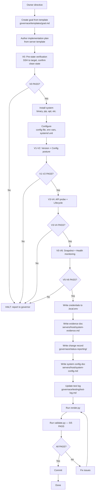

# System Deployment Workflow

Revision note (2026-08-30, A3 artifact-class policy): the gate previously read
"4/4 PASS"; it is preserved verbatim here as history. [LABELED CORRECTION
2026-08-30, append-only: the gate now reads 5/5 PASS — the governance-path check
SY-2 was added to the validation suite. Prior 4/4 wording is retained above as
history, not moved solely to Git history.]

## Deliverables created

- goal, plan, evidence doc, change record, system config doc, test log update, credentials

## Skills triggered

- **be-great** (TKV survey before install)

## Hooks triggered

- `validate-changed.sh` (PostToolUse), `secret-boundary.sh` (PreToolUse)
