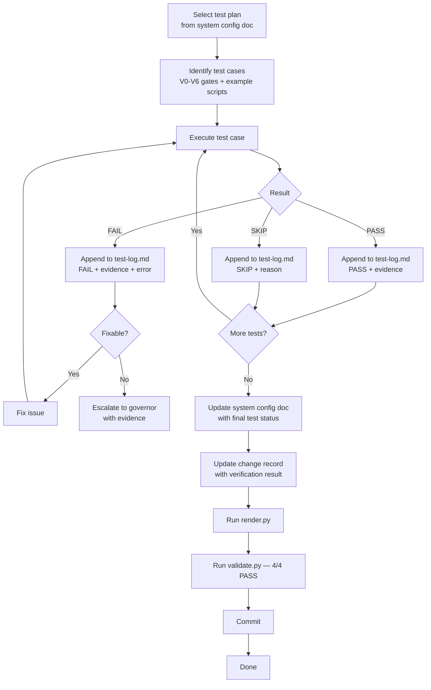

# System Validation Testing Workflow

Separate from deployment.

## Deliverables updated

- `test-log.md`, `system-config-doc.md`, `change-record.md`

## Skills triggered

- **be-great** (investigate failures)

## Hooks triggered

- `validate-changed.sh` (PostToolUse on `test-log.md`)
- `test-log-append.sh` (PostToolUse on test/evidence writes — reminds to append a dated row; added 2026-08-29, QA-audit ST-7)
- `render-sync.sh` (PostToolUse on `.md`/manifest writes — flags manifest drift before commit; added 2026-08-29, QA-audit ST-4)
