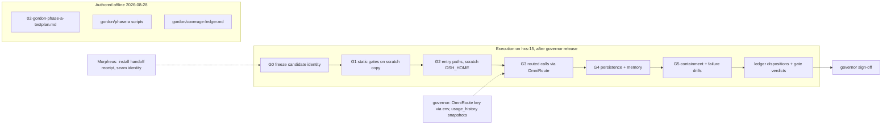

# Gordon — Phase A Test Plan (Gates 0–5)

- **Status:** authored offline 2026-08-28; reconciled the same day with the
  landed install (state-log row 7). Nothing below has executed under Gordon's
  hand; no result here is a finding. Execution begins when the governor
  releases this plan.
- **Author:** Gordon (KDD-0010), independent qualification. Gordon never repairs, never
  configures the candidate, never converts a non-pass into PASS.
- **Contract:** GOAL-DSH-IMPL-001 (`00-goal.md`) and the approved arc plan
  (`2026-08-28-dsh-full-implementation-plan.md`, Phase A: Gates 0–5, 23 named baseline
  families).
- **Landed candidate (Morpheus receipt `03-morpheus-phase-a-install.md` §10,
  handoff OPEN):** dsh 0.1.1-rc.2 at `/opt/dsh` (byte-identical transport of
  the pinned corpus, anchors MATCH), launcher `/usr/local/bin/dsh`,
  `DSH_HOME=/var/lib/dsh`, native `llm-pi-ai` route `omniroute`
  (openai-completions) to OmniRoute, Coder-X default model, boot smoke routed
  (Morpheus's install verification, not a Gate result). Gordon's G0 freeze
  re-discovers and re-pins this identity at execution (§8.3).
- **Candidate (review baseline, profile §3):** `dsh` 0.1.1-rc.2, tag `dsh-v0.1.1-rc.2`,
  commit `b150a551b8d465e31e418e1b2eaf5e79bbb7d28e`, pinned source
  `/opt/tkv-local/deepseek-harness-master`, Node `^22.19.0 || >=24.0.0`, pnpm 11.7.0.
  The review baseline is not the installed identity: Gate 0 discovers and freezes the
  live identity before any other gate runs (§8.3).
- **Environment (plan key context + rick's prep receipt
  `servers/hxs-15/2026-08-28-dsh-runtime-prep.md`):** hxs-15 = 192.168.50.214; Node
  v24.20.0 at `/opt/node-v24.20.0` (GPG-verified); pnpm 11.7.0; service user `dsh`
  (uid 999, no sudo, HOME=/home/dsh); `/opt/dsh` + `/var/lib/dsh`; OmniRoute at
  192.168.50.207:20128 with client key material held by the governor.

## 1. Doctrine applied

- Three proof layers per §9: real entry path, external effect, failure and recovery.
  No row passes on source existence, a build artifact, a plausible answer, or a mock.
- Oracles come from the pinned source (file:line cited per row), ratified HX contracts
  (profile §3 baseline, plan facts, rick's prep receipt, Trinity's OmniRoute gate
  record), or this work order. Never from a model under test.
- Routed-call oracles are known-answer markers chosen by Gordon, embedded in a unique
  per-run nonce. Trinity's gate record shows OmniRoute's semantic cache serves
  byte-identical repeats without a `usage_history` row; every routed probe here carries
  a fresh UUID nonce so each call forces a genuine backend round-trip and a usage delta
  (`05-trinity-l1-gate.md` §semantic-cache note).
- Flakes are recorded, never suppressed. Model-cooperation tests (the model must call
  a tool as instructed) allow one recorded re-run; both attempts go to evidence.
- Skip discipline: every non-PASS row carries its §7 disposition and a named reason.
  `NOT_RUN` is never counted as success.

## 2. Execution model and candidate-mutation boundary

Boundary rulings applied to every script:

1. The candidate installation (`/opt/dsh`) and its real home (`/var/lib/dsh`,
   receipt §6) are never written by a test. Static gates (G1) run against a
   byte-verified **scratch copy** of the source under the Gordon scratch area, so
   `pnpm` build outputs never touch the candidate tree.
2. Behavioral tests run the candidate binary as the `dsh` user with a per-test scratch
   `DSH_HOME` under the scratch area. Setting `DSH_HOME` and passing `--patch` are
   documented launcher inputs (`packages/util/home-paths/src/index.ts:87`,
   `apps/cli/src/args.ts:132`), not candidate configuration changes. Fixture patch
   files are Gordon's test data, rendered at runtime with environment values.
3. The only test that touches the real home is the real-seam routed run (G3-04R),
   which invokes the installed profile exactly as Morpheus configured it; creating a
   session is the product's own behavior, not a config edit.
4. Secrets: scripts reference credential **names** only. The OmniRoute client key value
   arrives at execution time through the environment variable named by
   `GORDON_OMNI_KEY_ENV`; no value is read, logged, or asserted beyond presence.
5. No host outside hxs-15 is contacted by the scripts except OmniRoute at
   192.168.50.207:20128, and only as the candidate's provider traffic plus the
   governor-mediated usage evidence path. `usage_history` lives in OmniRoute's SQLite
   on hxs-8 (Trinity's plane): Gordon does not reach across. The governor drops
   before/after snapshots into the evidence area; without them the affected rows are
   BLOCKED with the dependency named, never passed.

## 3. Environment contract (all values are names and paths, no secrets)

Defaults reconciled with the landed install (receipt §10). The full table
lives in `gordon/phase-a/gordon_util.py:ENV_DEFAULTS`.

| Variable | Default | Meaning |
| --- | --- | --- |
| `GORDON_DSH_BIN` | `/usr/local/bin/dsh` | candidate launcher shim (landed) |
| `GORDON_DSH_ROOT` | `/opt/dsh` | install root (source + node_modules + built lib) |
| `GORDON_DSH_SRC` | `/opt/dsh` | source tree for static gates |
| `GORDON_NODE` | `/opt/node-v24.20.0/bin/node` | Node v24.20.0 |
| `GORDON_DSH_USER` / `GORDON_DSH_UID` | `dsh` / `999` | service user |
| `GORDON_REAL_HOME` | `/var/lib/dsh` | landed harness home (read-only to tests except G3-04R product writes) |
| `GORDON_SCRATCH` | `/var/lib/dsh/gordon` | scratch root (copies, scratch homes, fixtures, evidence) |
| `GORDON_EVIDENCE_DIR` | `$GORDON_SCRATCH/evidence` | evidence pack destination |
| `GORDON_OMNI_BASE_URL` | `http://192.168.50.207:20128/v1` | OmniRoute OpenAI-compatible base |
| `GORDON_OMNI_KEY_ENV` | `OMNIROUTE_API_KEY` | NAME of the env var carrying the client key at exec |
| `GORDON_MODEL_QWEN` / `GORDON_MODEL_CODER` / `GORDON_MODEL_META` | `ollama-local/hx-qwen3.8-27b-64k:latest` / `…hx-qwen3.6-coderx-64k…` / `…hx-muse-glimmer-64k…` | fleet model ids per call-sign (receipt §10; override only if the fleet changes) |
| `GORDON_SEAM` | `auto` | fixture seam: `auto` → pi-ai (the landed native seam); `deepseek` comparison; `custom` needs Morpheus's contract |
| `GORDON_USAGE_DIR` | `$GORDON_SCRATCH/omni-usage` | governor-dropped usage_history snapshots (`before.json`, `after.json`) |
| `GORDON_RUNNER` | `auto` | candidate invocation: `auto` → runuser/sudo/direct by executor identity; all forms wrap `env -i` inside the privilege prefix (sudo env_reset safe) |

Credential mechanics (landed): the real home resolves the key natively from
`/var/lib/dsh/.env` (root:dsh 0640, receipt §6); the real-seam run (G3-04R)
and census (G3-01) need no executor-side key. The fixture-seam runs need the
governor-exported variable named above. Missing inputs produce BLOCKED with
the dependency named (§7), never a fabricated result. The full stop conditions
of §12.2 apply during execution.

## 4. Gate 0 — provenance and candidate identity

| Test ID | Entry path | Oracle source | Required evidence | Acceptable dispositions |
| --- | --- | --- | --- | --- |
| G0-01 | `sha256sum $GORDON_DSH_SRC/package.json pnpm-lock.yaml` | profile §3: `4adb…86d7`, `6f20…013e` (verified against the pinned corpus at authoring) | hash record vs baseline | PASS, FAIL, BLOCKED (no source on host) |
| G0-02 | parse root + `apps/cli/package.json` | pinned manifests: version `0.1.1-rc.2`, `packageManager pnpm@11.7.0`, engines `^22.19.0 \|\| >=24.0.0` | field capture | PASS, FAIL, BLOCKED |
| G0-03 | `$GORDON_NODE --version`; pnpm version probe | plan facts + rick receipt: v24.20.0, 11.7.0 | version strings | PASS, FAIL |
| G0-04 | `dsh --version` as dsh | `apps/cli/src/bin.ts:20-27` reads `apps/cli/package.json` | stdout == `0.1.1-rc.2` | PASS, FAIL, BLOCKED |
| G0-05 | identity freeze: install tree listing, bin path, file modes, `id dsh`, real-home listing | §8.3 freeze rule | freeze record in evidence pack; ledger candidate-identity fields populated | PASS, BLOCKED |
| G0-06 | `id -u dsh` == 999; `sudo -n -u dsh true` refusal probe (as dsh: `sudo -n true` fails) | plan key context; rick receipt | capture of both probes | PASS, FAIL |
| G0-07 | tree fingerprint (sha256 manifest of `$GORDON_DSH_ROOT` and `$GORDON_DSH_SRC`); re-run at campaign end | §5: a moving candidate voids results | two fingerprints, compared; drift = stop + escalate | PASS, FAIL (drift → campaign void) |

## 5. Gate 1 — static, build, repository quality

All G1 rows run in the scratch copy made after G0-01 verifies hashes. Repo commands are
the pinned root `package.json` scripts; scripts under `scripts/` are reviewed at
execution time before first run (profile §2: no unreviewed repo scripts).

| Test ID | Entry path | Oracle source | Required evidence | Acceptable dispositions |
| --- | --- | --- | --- | --- |
| G1-01 | `pnpm install --frozen-lockfile` in scratch copy | `pnpm-lock.yaml` pin; root `package.json` | exit code + stderr tail | PASS, FAIL, BLOCKED (registry unreachable) |
| G1-02 | `pnpm run typecheck` | root script: `tsc -b tsconfig.host.json` + client | exit code | PASS, FAIL, BLOCKED |
| G1-03 | `pnpm run lint` | root script: oxlint via `scripts/run-oxlint.ts` | exit code | PASS, FAIL, BLOCKED |
| G1-04 | `pnpm run build` | root script: `tsx scripts/build.ts`; bin at `apps/cli/lib/bin.js` per `apps/cli/package.json` `bin` | exit code + artifact presence | PASS, FAIL, BLOCKED |
| G1-05 | `pnpm run test` (vitest unit, keyless) | root script; `docs/testing.md` tiers | suite summary (pass/skip counts; skips recorded, not suppressed) | PASS, FAIL, BLOCKED |
| G1-06 | `pnpm run test:snapshot` (keyless replay) | `docs/testing.md`: fixtures replay on macOS/Linux | suite summary | PASS, FAIL, BLOCKED |
| G1-07 | `pnpm run hygiene` | root script: knip + publint + constraints + NodeNext check | exit code | PASS, FAIL, BLOCKED |
| G1-08 | built-bin smoke: `node apps/cli/lib/bin.js --version` from scratch build | `apps/cli/src/bin.ts` dispatch; version reader | stdout == `0.1.1-rc.2` | PASS, FAIL, BLOCKED |
| G1-09 | repo real-API e2e (`pnpm run test:e2e`) | `docs/testing.md`: self-skips without keys; targets DeepSeek cloud | not executed: cloud keys prohibited without owner word | **DEFERRED_BY_POLICY** (local-only doctrine, `00-goal.md` boundaries) |

## 6. Gate 2 — runtime composition and product entry paths

Behavioral rows use a per-test scratch `DSH_HOME`. Oracle rows cite the composed
bundle patches (`packages/bundle/base/cordis.patch.yml`,
`packages/bundle/headless/cordis.patch.yml`) and launcher source.

| Test ID | Entry path | Oracle source | Required evidence | Acceptable dispositions |
| --- | --- | --- | --- | --- |
| G2-01 | `dsh -h` | `apps/cli/src/args.ts:64-72,121-145` | help text contains `--profile`, `--patch`, `web`, `plugin`; exit 0 | PASS, FAIL |
| G2-02 | `dsh` (no profile) | `args.ts:140`: `error: --profile <name> is required` | non-zero exit + stderr text | PASS, FAIL |
| G2-03 | `dsh --profile headless --dump-default-config` | base+headless patch row ids: `llm`, `session`, `agent`, `agent-default-model`, `agent-loop`, `system-prompt`, `tools`, `credentials`, `settings`, `session-persistence-jsonl`, `session-projection`, `session-checkpoint-policy`, `session-title`, `session-telemetry-otel`, `sandbox`, `sandbox-policy`, `approval`, `permission`, `subprocess`, `tool-bash`, `tool-fs`, `spill-local`, `attachment-local`, `llm-deepseek`, `llm-pi-ai`, `llm-retry`, `token-meter`, `compaction-basic`, `headless-runner` | composed YAML captured; each row id present | PASS, FAIL |
| G2-04 | `dsh --profile headless --dump-config --dump-default-config` | `args.ts:89-91` mutual exclusion | non-zero exit + error text | PASS, FAIL |
| G2-05 | first boot, scratch home | `packages/boot/app-boot/src/profile.ts:114-117,152-168`: `headless` auto-inits `profiles/headless/{package.json,cordis.patch.yml,pnpm-workspace.yaml}`, bundles `[dsh-base, dsh-headless]` | files exist; manifest bundles list | PASS, FAIL |
| G2-06 | `dsh --profile ../x --dump-config` | `profile.ts:104-111`: invalid name rejection | non-zero exit + `invalid profile name` | PASS, FAIL |
| G2-07 | `dsh --profile nosuch --dump-config` | `profile.ts:376-384`: no template → create-with-plugin error | non-zero exit + `does not exist` text | PASS, FAIL |
| G2-08 | `dsh --profile headless --help` | `packages/bundle/headless/src/startup.ts:40-52` | app help text; exit 0 | PASS, FAIL |
| G2-09 | `dsh --profile headless ""` | `startup.ts:58-61`: whitespace task is a usage error | non-zero exit + `a task is required` | PASS, FAIL |
| G2-10 | `dsh --profile web --host 127.0.0.1 --port 0`, loopback TCP bind probe, then SIGTERM | `packages/bundle/web-app/src/startup.ts:51-59`; `apps/cli/src/profile-boot.ts:221` SIGTERM→exit 0 | listener accepts on loopback; HTTP status recorded observationally; exit 0. Frontend dist deliberately absent in Phase A (receipt §5): early exit naming it → **BLOCKED-by-design** (Phase B) | PASS, FAIL, BLOCKED |
| G2-11 | `dsh --profile web --host 0.0.0.0` | `web-app/src/startup.ts:75`: refusal, "intentionally not supported yet for safety" | non-zero exit + refusal text | PASS, FAIL |
| G2-12 | `dsh plugin --profile headless` (no pnpm args) | `args.ts:179-180` | non-zero exit + usage error | PASS, FAIL |
| G2-13 | telemetry composition: default dump carries `session-telemetry-otel` with the DISABLED-default mode expression and bounded-drain values | base bundle rows 129-161; `dump-config.ts` is boot-free so the launcher disable patch (`profile-boot.ts:80-83`) is not dump-visible | dump capture; runtime switch leg lives in G4-09 | PASS, FAIL |
| G2-14 | `DSH_HOME` override honored: boot with scratch env | `packages/util/home-paths/src/index.ts:87-91` | all artifacts under scratch home, none under real home | PASS, FAIL |
| G2-15 | system-prompt assembly proof (routed run, then session-log request header) | headless bundle persona text; repo rule "model-visible ⟺ logged" (`AGENTS.md`) | request header in session log carries the persona with `{{model}}`/`{{cwd}}` substituted | PASS, FAIL, BLOCKED (needs G3 routing) |

## 7. Gate 3 — providers, models, Omni integration

**Seam question RESOLVED (receipt §7):** dsh ships a native OpenAI-compatible
seam — `llm-pi-ai` hand-declared routes (`api: openai-completions`); no
out-of-tree adapter was required. The landed machine layer
(`/var/lib/dsh/cordis.patch.yml`) declares route `omniroute` with
`baseURL http://192.168.50.207:20128/v1`, `apiKeyEnv: OMNIROUTE_API_KEY`,
compat `supportsDeveloperRole: false` + `maxTokensField: max_tokens`, the
three fleet model ids (65536 ctx / 8192 maxTokens), and `agent-default-model`
= `omniroute` / Coder-X. `llm-deepseek` (cloud) is disabled in the landed
composition. Gordon's fixture-seam runs replicate this shape in scratch homes;
the real-seam run (G3-04R) exercises the landed profile unmodified, resolving
the credential natively from `/var/lib/dsh/.env`.

Seam facts traced at rc.2 (the in-tree mechanics behind the finding):

- `llm-deepseek` owns route `deepseek-official`; `baseURL` config → `$DEEPSEEK_BASE_URL`
  (trusted layer) → `https://api.deepseek.com`; requests POST `<baseURL>/chat/completions`
  with `Authorization: Bearer` (`packages/llm/llm-deepseek/src/index.ts:79-81,181-185`,
  `adapter.ts:71-72,521,607`). The model catalog is configurable (`models`).
- `llm-pi-ai` owns a route dict; hand-declared routes take `api: openai-completions`,
  `baseURL`, `apiKeyEnv`, explicit `models` (`packages/llm/llm-pi-ai/src/index.ts:30-52`,
  `provider.ts:48-50`). The shipped base bundle mounts it dormant (zero routes).
- Default model selection: `agent-default-model` row config `deepseek-official` /
  `deepseek-v4-flash`, overridable live via the `agent-default-model` settings section
  (`packages/core/agent-default-model/src/index.ts:26-46`).

Gordon qualifies whichever seam Morpheus lands (`GORDON_SEAM`, auto-detect from the
real composed config). Fixture-seam runs (suffix -F) use a scratch home and a Gordon
patch overlay; the real-seam run (G3-04R) uses the installed profile unmodified.

| Test ID | Entry path | Oracle source | Required evidence | Acceptable dispositions |
| --- | --- | --- | --- | --- |
| G3-01 | seam census: `dsh --profile headless --dump-config` on the real home + fixture detection logic | composed config vs the two in-tree seams above | recorded seam identity, route names, model ids; feeds ledger | PASS, FAIL (contradictory composition), BLOCKED |
| G3-02 | no-credential failure: scratch run with key env unset | `llm-deepseek/src/index.ts:427-431`: `LlmError` code `MISSING_CREDENTIAL`; headless fail path `packages/bundle/headless/src/index.ts:79-82,126-129` | exit 1; stderr `MISSING_CREDENTIAL` | PASS, FAIL |
| G3-03 | provider-down: fixture route to `http://127.0.0.1:<closed-port>` with `retryPolicy` bounded to 1 | `adapter.ts:498`: `TRANSPORT`; retry knob `llm-deepseek` Config `retryPolicy` | exit 1; `TRANSPORT` error; wall-clock bounded; session log durable retry/failure events | PASS, FAIL |
| G3-04R | real-seam routed run: installed profile unmodified, known-answer task with nonce; credential resolves natively from `/var/lib/dsh/.env` (receipt §6) | this work order; Trinity gate record (nonce discipline); receipt §8 landed defaults | exit 0; stdout/session-log marker; session artifact | PASS, FAIL, BLOCKED (seam not landed) |
| G3-04F/05F/06F | fixture-seam routed runs: Qwen-X, Coder-X, Meta-X (`GORDON_MODEL_*`), one run each, unique nonce markers `GORDON-PROBE-<uuid>` | known-answer oracle chosen by Gordon; `llm-pi-ai` or `llm-deepseek` fixture config | per run: exit 0, marker in `assistant/message`, `turn/end` reason `completed` | PASS, FAIL, BLOCKED |
| G3-07 | usage_history evidence: governor snapshots `before.json`/`after.json` around G3-04..06 | Trinity gate record: `usage_history` rows with `tokens_input`, `tokens_output`, `latency_ms`, `ttft_ms`, `api_key_id` (`03-trinity-l1-install.md:217`) | row-count delta == number of routed calls (+title-generation calls, counted openly); per-row model attribution matches the call-sign | PASS, FAIL, **BLOCKED-by-design** (governor snapshot absent: named dependency, Trinity plane) |
| G3-08 | usage reconciliation: dsh-side usage vs Omni rows | `llm-deepseek/src/translate.ts:53-58` `mapUsage` → `TokenUsage`; session-log usage records | both sides non-zero for the same run; same order of magnitude; discrepancies recorded, not explained away | PASS, FAIL, BLOCKED (needs G3-07) |
| G3-09 | llm-retry durable scheduling: provider-down drill with `maxRetries: 2` | `packages/llm/llm-retry/src/index.ts:1-6`: each scheduled retry durable before its cancellable wait | session log contains retry events before final failure; final exit 1 | PASS, FAIL |
| G3-10 | token-meter: post-run measurement presence | `packages/llm/token-meter/src/index.ts`: replay-aware measurement over session events | measurement data derivable from the session event stream after a routed run | PASS, FAIL, BLOCKED |
| G3-11 | catalog self-consistency: composed `models` for the landed seam vs effective config dump | fixture/effective config is the oracle of record | dump matches handoff model ids; mismatch = FAIL (identity ambiguity) | PASS, FAIL, BLOCKED |
| G3-12 | no-cloud-leak static leg: composed baseURLs contain no `api.deepseek.com` | `llm-deepseek/src/index.ts:182` `PUBLIC_BASE_URL`; local-only doctrine (`00-goal.md`) | dump-config capture; dynamic leg is G3-07 attribution | PASS, FAIL |

## 8. Gate 4 — sessions, events, persistence, memory

Format oracles: `packages/session/session-persistence-jsonl/src/format.ts` (layout,
header, scanner), `packages/core/session/src/types.ts:56` (`SESSION_FORMAT_VERSION = 0`),
persistence defaults in `session-persistence-jsonl/src/index.ts:38` (zstd default;
root mode 0700). Decode mechanics (Morpheus receipt §9 tooling note, verified on
hxs-15): artifacts are CONCATENATED zstd frames, one per write batch; Node's
one-shot/streaming decode yields frame 1 only, so the suite's decoder splits on
the frame magic and decodes frame-wise (`fixtures/decode-zstd.mjs`, zstd CLI
fallback).

| Test ID | Entry path | Oracle source | Required evidence | Acceptable dispositions |
| --- | --- | --- | --- | --- |
| G4-01 | routed run → artifact discovery under scratch home | `format.ts:189-208`: `$DSH_HOME/sessions/<projectKey(cwd)>/<encodeSegment(id)>/session.jsonl.zstd` | artifact path matches the derived layout | PASS, FAIL, BLOCKED |
| G4-02 | header parse of the artifact | `format.ts:33-44,89-108`; version 0 | header fields: `type=session`, `version=0`, `id`, `createdAt`, `delegationDepth` | PASS, FAIL, BLOCKED |
| G4-03 | event-stream audit | headless `summarize` (`headless/src/index.ts:56-79`); scanner seq rule (`format.ts:362-376`) | `turn/start` → `assistant/message` → `turn/end` (`completed`); seq contiguous from 0 | PASS, FAIL, BLOCKED |
| G4-04 | restart durability: two sequential runs, distinct homes unchanged | append-only log contract (`format.ts` module doc) | run-1 artifact byte-identical after run 2; both parse | PASS, FAIL, BLOCKED |
| G4-05 | checkpoint-policy presence + kill-drill parse (with G5-09) | base row `session-checkpoint-policy`; scanner torn-tail finish (`format.ts:337-344`) | killed run's log parses as a committed prefix; seq contiguous | PASS, FAIL, BLOCKED |
| G4-06 | corrupted-copy recovery: (a) corrupt a copy in a scratch home, boot + run; (b) resume-path against corruption | (a) boot resilience is product behavior; (b) no headless resume/list entry exists in the pinned CLI (only `web`/`tui` surfaces resume, `args.ts:68-69`) | (a) boot + new run succeed with a corrupt sibling present; (b) **BLOCKED-by-design** in Phase A, reassigned Phase B Gate 7 | (a) PASS, FAIL; (b) BLOCKED |
| G4-07 | session-query-sqlite default posture | base row: `path: ':memory:'`, `openAt: never`; comment rows 108-116 | dump capture; disposition AVAILABLE_DISABLED for content search | PASS (composition), AVAILABLE_DISABLED (search) |
| G4-08 | session title after routed run | base rows `session-title` (+`-first-prompt-llm`) config | title event/record present in the session stream; extra title LLM call counted in G3-07 | PASS, FAIL, BLOCKED |
| G4-09 | telemetry posture: switch set vs unset against a closed OTLP endpoint | base rows 129-147: bounded drain ≈1s, shutdown bound 3s | switch set: no export attempt, fast exit; unset with `DSH_TELEMETRY_MODE=FULL` + `DSH_TELEMETRY_OTLP_URL=http://127.0.0.1:<closed>`: run still exits bounded | PASS, FAIL |
| G4-10 | anonymous identity file | `packages/identity/anonymous-user-id/src/index.ts:29`: `.anonymous-user-id`, bare UUID line | file created in scratch home; stable across two runs; valid UUID | PASS, FAIL |
| G4-11 | settings-driven model selection across runs | `agent-default-model` settings section (live read per Agent creation) | two runs, two `settings.yaml` eras in the scratch home; request headers show each era's provider/model | PASS, FAIL, BLOCKED |
| G4-12 | attachment-local | `attachment-local/src/index.ts:160`: root `$DSH_HOME/attachments/v1`; no headless attach entry (`startup.ts` has only the task positional) | composition row present; behavior **NOT_RUN** (no Phase A entry path), Phase B pointer | PASS (composition), NOT_RUN (behavior) |
| G4-13 | spill on oversized tool output | base `spill-policy` `maxInlineBytes: 50000`; `tool-bash` description: tail-truncated, full output saved, path reported | routed run producing >50 KB tool output: result carries `spillPath`; spill file exists and holds the full bytes (model-cooperation class; one recorded re-run allowed) | PASS, FAIL, BLOCKED |
| G4-14 | storage family | web-app bundle rows `storage`, `storage-json` (`dshHomePath('storages')`); `storage-sqlite` unmounted | web-profile dump capture; behavior **NOT_RUN** in Phase A (web plane), Phase B pointer | PASS (composition), NOT_RUN (behavior), AVAILABLE_DISABLED (storage-sqlite) |
| G4-15 | credentials layering: env seam (proven by G3 runs) and `$DSH_HOME/.env` fallback | `credentials-local/src/index.ts:2-17`; `app-boot/src/index.ts:167-190` layered env | routed run with the key only in scratch `$DSH_HOME/.env` succeeds; managed `.credentials.yaml` never materialized to process env (asserted via `$DSH_*`-only env listing in a bash tool call) | PASS, FAIL, BLOCKED |
| G4-16 | session-stats / projection-cache mounting census | mounted by the **web-app** bundle only (rows 76-77, 90-91), not headless | dump captures; headless composition lacks rows by design | PASS (web composition), AVAILABLE_DISABLED (headless plane) |
| G4-17 | agent-instructions context: workspace `AGENTS.md` with a static marker, routed run | base row `agent-instructions` (`maxBytes: 65536`); model-visible ⟺ logged | marker present in the session's `request/header` or `request/context` records | PASS, FAIL, BLOCKED |
| G4-18 | telemetry-otel family row | base row config + `DSH_TELEMETRY_*` env seams | covered by G2-13/G4-09 evidence | PASS via G2-13/G4-09 |

## 9. Gate 5 — tools, permissions, containment

Oracles: base bundle rows for `sandbox-policy` (`DSH_PERMISSION_MODE ?? 'workspace-write'`,
root `process.cwd()`), `approval` (`never` only under `danger-full-access`, else `ask`),
`bash-sandbox` (`timeoutMs: 60000`); `user-approval` fail-closed semantics
(`packages/interaction/user-approval/src/index.ts:85-102`); `tool-bash` contract
(`packages/shell/tool-bash/src/index.ts:70-93`); sandbox-policy mode texts
(`packages/sandbox/sandbox-policy/src/index.ts:40-45,94`). Headless mounts no answerer,
so `ask` fails closed, which is the Phase A containment stance. Model-cooperation rows
follow the flake discipline of §1.

| Test ID | Entry path | Oracle source | Required evidence | Acceptable dispositions |
| --- | --- | --- | --- | --- |
| G5-01 | bash execution: routed run instructed to run `echo` with a nonce marker | `tool-bash` schema (`command`, `description`); `[exit code: N]` reporting | session log: bash tool call + result contains marker, exit 0 | PASS, FAIL, BLOCKED |
| G5-02 | workspace write: instructed file create under scratch cwd | `workspace-write` mode text (sandbox-policy:42-43) | file exists byte-identical to instructed content (external assert) | PASS, FAIL, BLOCKED |
| G5-03 | workspace escape denied: instructed write to `../` outside cwd | denial marker `[sandbox: file access denied under workspace-write mode]` (tool-bash:78) | marker in tool result; target file absent | PASS, FAIL, BLOCKED |
| G5-04 | read-only mode: `DSH_PERMISSION_MODE=read-only`, instructed write | mode text (sandbox-policy:40-41); base row env seam | denial marker names `read-only`; file absent | PASS, FAIL, BLOCKED |
| G5-05 | approval fail-closed: instructed escalation with `sandbox_permissions` + `justification` | pairing rule (tool-bash:65-67); `ask` with no answerer fails closed (user-approval:88-92,102) | `approval/asked` then `approval/decided: rejected` events; no file written | PASS, FAIL, BLOCKED |
| G5-06 | danger-full-access semantics: `DSH_PERMISSION_MODE=danger-full-access`, instructed write to a scratch path outside cwd | base approval-row expression; mode text (sandbox-policy:44-45) | write succeeds (in scratch only); dump shows approval policy `never` | PASS, FAIL, BLOCKED |
| G5-07 | bash timeout: instructed `sleep` with explicit small `timeoutMs` | tool description: executor kills on expiry (`tool-bash:254`) | result `timedOut: true`; wall-clock bounded | PASS, FAIL, BLOCKED |
| G5-08 | SIGINT drill: signal mid-run | `profile-boot.ts:222`: SIGINT→130 | exit 130; log parses as committed prefix | PASS, FAIL |
| G5-09 | SIGKILL drill: kill mid-run, then cold boot | scanner torn-tail semantics (`format.ts:337-344`) | kill; next boot + run succeed; killed log parses (with G4-05) | PASS, FAIL |
| G5-10 | SIGTERM drill: signal a long-lived web boot | `profile-boot.ts:221`: SIGTERM→0 | exit 0; same frontend-dist BLOCKED-by-design caveat as G2-10 | PASS, FAIL, BLOCKED |
| G5-11 | invalid config: (a) malformed YAML `--patch`; (b) schema violation `--patch` (`maxTokens: -1`) | fail-loud doctrine (`AGENTS.md`: misconfiguration fails loud at load); `llm-deepseek` Config schema bounds | non-zero exit naming the file/field; no partial boot | PASS, FAIL |
| G5-12 | public-bind refusal (cross-listed G2-11) | `web-app/src/startup.ts:75` | see G2-11 | PASS, FAIL |
| G5-13 | background job smoke: instructed `run_in_background` long command, then `job_output` | `tool-bash` background contract (`tool-bash:72-73,256-257`); `jobs` row in base | job id returned; output collected; marker present | PASS, FAIL, BLOCKED |
| G5-14 | managed `DSH_*` environment in tool shell | `packages/shell/shell-env/src/index.ts:71-75` (`DSH_SHELL`, `DSH_SESSION_ID`, `DSH_SESSION_JSONL`, `DSH_HOME`) | bash tool `env` listing contains the managed keys; no credential values present | PASS, FAIL, BLOCKED |
| G5-15 | model-visible tool catalog census | base rows: `tool-bash`, `tool-fs`, `tool-fs-search`, `tool-str-replace-editor`, `tool-todo`, `tool-web` (search only), etc. | request-header tool list in session log matches the composed set (within one tolerance list recorded in evidence) | PASS, FAIL, BLOCKED |
| G5-16 | pwsh rows platform-gated on Linux | base rows `disabled: !!js process.platform !== 'win32'` for pwsh (dump prints `!!js` verbatim, unevaluated — `renderConfigDump` contract) | dump shows the gate expression; runtime effect cross-proven by the G5-15 tool census (no pwsh tools offered) | PASS (evidence for the family's NOT_APPLICABLE row) |

## 10. Family-to-gate map (23 named families)

| # | Family (plan name) | Packages enumerated from the tree | Primary gates |
| --- | --- | --- | --- |
| 1 | boot | `boot/app-boot`, `boot/cmdline` | G0, G2 |
| 2 | core | `agent`, `agent-loop`, `system-prompt`, `tools`, `scope`, `session`, `agent-default-model`, `agent-tool-presentation` | G2–G5 |
| 3 | util | `atomic-write`, `brand`, `home-paths`, `launch-environment`, `native-command`, `output-retention`, `timeout` | G1 (unit), G2–G5 transitive |
| 4 | fs | `fs`, `fs-local`, `fs-observation-policy`, `fs-sandbox`, `tool-fs`, `tool-fs-search`, `tool-str-replace-editor` | G5 |
| 5 | host | `apiproxy`, `webserver`, `frontend-static`, `plugin-inventory`, `directory-picker*` | G2 (boot paths); behavior Phase B |
| 6 | identity | `anonymous-user-id` | G4 |
| 7 | settings | `settings`, `settings-file` | G3, G4 |
| 8 | context | `agent-instructions`, `file-reference(-local)`, `session-reference`, `time-context`, `tmux-context` | G4 (agent-instructions); rest census/Phase B |
| 9 | compaction | `compaction`, `compaction-basic`, `compaction-tool-result-pruner`, `command-compact` | G3/G4 census; live trigger drill deferred (see §11 R2) |
| 10 | llm | `llm`, `llm-deepseek`, `llm-pi-ai`, `llm-retry`, `token-meter` | G3 |
| 11 | session | 13 packages (plan says 11; reconciled in ledger §session): `session-persistence`, `-persistence-jsonl`, `-persistence-sqlite`, `-projection`, `-projection-cache`, `-checkpoint-policy`, `-stats`, `-telemetry`, `-telemetry-otel`, `-title`, `-title-llm`, `-title-first-prompt-llm`, `-title-all-prompts-llm` | G4 |
| 12 | storage | `storage`, `storage-domain`, `storage-json`, `storage-sqlite` | G4 census; behavior Phase B |
| 13 | credentials | `credentials`, `credentials-local`, `authorization` | G3, G4 |
| 14 | shell | `shell`, `shell-env`, `bash-local`, `bash-sandbox`, `tool-bash`, `tool-bash-persistent` (+ pwsh ×4, Windows-only) | G5 |
| 15 | subprocess | `subprocess`, `subprocess-local` | G5 |
| 16 | interaction | `commands`, `permission-presets`, `user-approval`, `user-questions`, `tool-ask-user` | G5 |
| 17 | attachment | `attachment`, `attachment-local` | G4 census; behavior Phase B |
| 18 | spill | `spill`, `spill-local`, `spill-policy` | G4 |
| 19 | runtime-diagnostics | `invariants` | G1 (static gate), composition census |
| 20 | apps/cli | `apps/cli` | G0–G5 everywhere |

**Count reconciliation (Q1):** the plan text names 20 family headings under a "23"
count, and "session (all 11)" while the tree holds 13 session packages. The ledger
enumerates every package from the tree so coverage is exact regardless of heading
arithmetic; the count discrepancy is flagged to the governor for reconciliation at the
checkpoint.

## 11. Risks, BLOCKED-by-design rows, open questions

- **R1 — G3-07 usage_history is governor-mediated.** The SQLite ledger lives on hxs-8
  (Trinity plane). Without before/after snapshots the row is BLOCKED-by-design, named
  dependency: governor/Trinity. This is the single routed-evidence row that cannot be
  self-served from hxs-15.
- **R2 — live compaction trigger is not cheaply provable in Phase A.** Forcing real
  compaction needs context pressure; the fixture path (tiny declared `contextWindow`)
  is model-behavior dependent and burn-prone. Disposition: census PASS (composition),
  behavior **NOT_RUN** with a Phase B reassignment unless the governor accepts the
  fixture-cost drill at execution time.
- **R3 — model-cooperation rows** (G5-01..07, G5-13, G4-13, G2-15) depend on the
  routed model following tool-use instructions. One recorded re-run each; persistent
  failure records FAIL with transcripts, never a suppressed skip.
- **R4 — RESOLVED (receipt §10).** The install shape is landed: `/opt/dsh` (source +
  node_modules + built lib), launcher `/usr/local/bin/dsh`, `DSH_HOME=/var/lib/dsh`.
  Defaults updated; overrides remain for future phases.
- **R5 — RESOLVED (receipt §7).** The native pi-ai seam landed; no out-of-tree
  adapter. The `GORDON_SEAM=custom` path stays in the suite for future seams.
- **R6 — web frontend dist is deliberately absent in Phase A** (receipt §5,
  `build:web` not run). G2-10/G5-10 assert the bind + signal contract only;
  an early exit naming the missing dist is BLOCKED-by-design, Phase B pointer.
- **R7 — upstream advisory debt of the pinned snapshot** (receipt R1: 38
  advisories, 15H/20M/3L). Pin stands per work order; recorded for the
  governor's risk register; no local remediation authorized.
- **Q1 — family count** (see §10). **Q2 — RESOLVED:** fleet model ids are in the
  receipt and now the suite defaults. **Q3 — usage snapshot format** the governor will
  drop (script accepts JSON with `count` and optional `rows[]`; contract documented in
  the runbook).

## 12. Directory-wide review surface (owner directive 2026-08-28, charter amendment)

The owner amended Gordon's charter mid-authoring: the review surface is the
ENTIRE `/opt/tkv-local/deepseek-harness-master` directory — code, `docs/`
(including the cookbook), examples, schemas, scripts — and the cookbook is
first-class test material. Phase A mapping (deep dives into examples, website,
and advanced cookbook surfaces land in their own phases per the arc plan):

| Surface | Phase A use | Rows |
| --- | --- | --- |
| `docs/testing.md` | repo test-tier policy behind the G1 gates (unit/snapshot/hygiene; e2e DEFERRED_BY_POLICY) | G1-01..09 |
| `docs/cookbook/adding-a-tool.md` | tool-registry contract (`defineTool` shape, render intent, executor enforcement) supplementing the tool census oracle | G5-15 |
| `docs/cookbook/adding-a-package.md`, `packages/AGENTS.md` | package/invariant conventions behind the hygiene gates | G1-07 |
| `docs/architecture.md`, `docs/postmortem/`, `docs/glossary.md` | architecture oracles consumed while tracing (capability seams, agent-loop boundaries) | G2–G5 oracles |
| `scripts/` | reviewed before execution per profile §2; the pinned root `package.json` script names are the G1 entry paths | G1 |
| `examples/`, `website/`, `docs/cookbook` remaining guides | not Phase A surface | Phase B/C rows in the arc plan |

## 13. Script inventory

All under `pilots/PILOT-DSH-IMPL-001/gordon/phase-a/` (static artifacts; authored, not
executed):

- `run-phase-a.sh` — orchestrator: preflight (tools, identity, env census), per-gate
  pytest invocation, verdict aggregation, evidence pack assembly.
- `conftest.py` + `gordon_util.py` — environment contract, run-as-dsh wrapper
  (`env -i` inside the privilege prefix), scratch homes, fixture rendering,
  frame-wise zstd decode (candidate Node `node:zlib` per receipt §9, `zstd` CLI
  fallback), session-log parser, evidence recorder (test ID, candidate identity,
  environment, command, observed, oracle, disposition, artifact pointer per §13 of my
  profile).
- `test_g0_identity.py`, `test_g1_static.py`, `test_g2_entry.py`,
  `test_g3_providers.py`, `test_g4_sessions.py`, `test_g5_containment.py`.
- `fixtures/` — patch-overlay templates (`pi-ai` route with the landed compat
  switches, `deepseek` comparison route), the frame-wise zstd decoder, and the
  marker workspace file (AGENTS.md instruction probe). The malformed-YAML and
  schema-violation patches for G5-11 are generated inline by the test.
- `README.md` — execution runbook: prerequisites, env contract, governor inputs,
  per-gate commands, stop conditions.

Completion language at execution: `[GATE VERDICT — <gate> — <verdict>]` per gate,
`[CAMPAIGN COMPLETE — <verdict>]` when the ledger closes, and
`[STOP CONDITION — ESCALATION TO KK3]` on any §12.2 condition.
