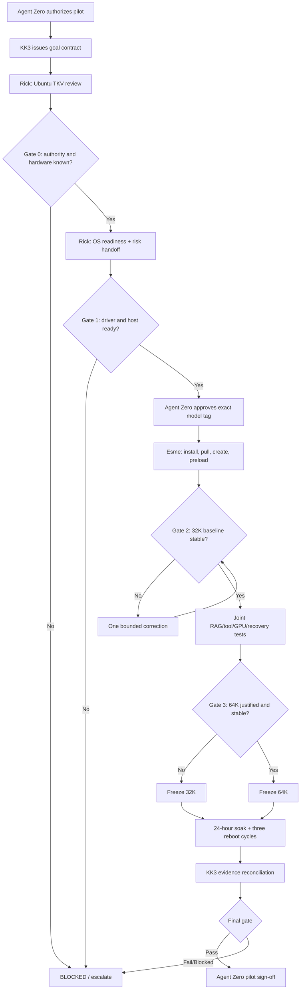

# HX-1 Ollama Qwen 27B Pilot Project

## Document control

| Field | Value |
|---|---|
| Project | `PILOT-HX1-OLLAMA-QWEN27B-001` |
| Version | 1.0 (ratified 2026-08-24; A01 adopted 2026-08-25) |
| Date | 2026-08-24 |
| Status | **ADOPTED 2026-08-24 with amendments (KDD-0004; A01 adopted 2026-08-25) — M0 authorized 2026-08-24; in execution** |
| Human authority | Agent Zero |
| Control plane | KK3 Meta-Agent (kimi-k3) |
| Ollama specialist | John-Ollama (operational call sign: Esme; roster name `john`) |
| Ubuntu specialist | Rick-Ubuntu-Engineer-Admin (roster name `rick`) |
| Target | HX-1 (192.168.50.200), Ubuntu 24.04 LTS |
| Authoritative runtime evidence | Pre-flight captured 2026-08-24 (see section 3 host table) |

> This document is a production-grade pilot plan, not evidence that HX-1 has already been configured. Every value marked **[TO BE CONFIRMED]** must be replaced by timestamped host evidence before implementation passes its first hold point.

## Executive decision (amended at adoption, KDD-0004)

The requested model identifiers are not valid as written. The official Ollama library does not provide `qwen2.5:27b`, and `qwen3:27b-mlx` is not an official Qwen3 tag. Verified live against the Ollama library on 2026-08-24: `qwen3.5:27b`, `qwen3.5:27b-mlx`, `qwen3:30b`, and **`qwen3.8:27b` all exist**. The ratified SERVER-REGISTRY workload for hxs-1 is "Qwen 3.8 27B" (marked unreleased on 2026-08-13; now released). The approved pilot baseline, decided by Agent Zero on 2026-08-24, is therefore:

```text
qwen3.8:27b (non-MLX, GGUF) — APPROVED BASELINE (Agent Zero, 2026-08-24, KDD-0004)
```

`qwen3.8:27b-mlx` is not the validated baseline for this Ubuntu/NVIDIA machine. A Linux MLX experiment may be conducted later as a separate compatibility benchmark; it must not silently replace the GGUF pilot. The `qwen3.5:27b` candidate from the original draft is superseded by the ratified registry workload.

Two other requested controls are corrected:

1. `OLLAMA_NUM_GPU` and `OLLAMA_GPU_LAYERS` are not supported Ollama server variables for balancing two GPUs. Ollama schedules model placement automatically. `CUDA_VISIBLE_DEVICES` selects the eligible GPUs; actual placement must be proven.
2. “Maximum RAM use” is not an optimization goal. The goal is maximum safe GPU residency without OOM, with system RAM retained as controlled overflow and OS headroom. CPU/RAM offload is a measured fallback, not a success condition.

---

## 1. Pilot overview and objectives

### 1.1 Goal

Deploy a validated Qwen 27B-class model through Ollama on HX-1 and optimize it for:

- grounded RAG generation;
- schema-constrained agent tool calling;
- repository-scale coding tasks;
- maximum measured reasoning and task accuracy, with latency secondary;
- unattended boot recovery and continuous local availability;
- deterministic, evidence-gated operations.

### 1.2 Success criteria

The pilot succeeds only when all mandatory conditions are evidenced:

1. The exact model tag, digest, quantization, size, license, and Modelfile hash are frozen.
2. Both GPUs are detected, eligible, healthy, and allocated by Ollama when the selected model/context requires multi-GPU placement.
3. The selected context is the largest quality-first setting that passes capacity, accuracy, and 24-hour stability tests without OOM or unapproved CPU fallback.
4. Ollama starts automatically, the target model is preloaded after every boot, and `keep_alive=-1` retains it while the service is healthy.
5. Three consecutive cold-reboot tests return HX-1 to ready state without human intervention.
6. An idle-residency test exceeds the default five-minute unload interval and a 24-hour mixed-workload soak records no unexplained unload, restart loop, OOM, or GPU-to-CPU fallback.
7. RAG answers meet the pilot groundedness/citation threshold; tool calls pass schema, authorization, and loop-control tests.
8. The API is not exposed without an approved authentication, TLS, firewall, and source-allowlist boundary.
9. Rick and Esme submit complete, sanitized evidence packages; KK3 passes the final evidence gate; Agent Zero signs off.

### 1.3 Non-goals

- Guaranteed equal 50/50 GPU utilization; Ollama does not expose that contract.
- Consuming all available RAM.
- Production fleet rollout.
- Fine-tuning or model training.
- Running CUDA and ROCm stacks together.
- Treating a successful chat response as sufficient acceptance evidence.

---

## 2. Agent roles, responsibilities, and deliverables

There are three agent roles. KK3 is the Meta-Agent; it is not a fourth operational worker.

**Phase M execution note (KDD-0004):** during Phase M, the specialists execute as profile-briefed Kimi Code sub-agents — fresh bounded sessions carrying the role profile, work order, and context packet. The KK3 governor session runs no host probes and makes no host changes itself; "prohibited" in the role table refers to the governor session under this dispatch model.

| Role | Owns | Required deliverables | Prohibited |
|---|---|---|---|
| **KK3 — Meta-Agent** | Goal contract, work graph, context routing, budgets, dependency resolution, evidence gates, synthesis, escalation | Versioned plan; work orders; conflict/gap register; gate decisions; unified pilot record; sign-off packet | Shell access, host changes, installation, editing runtime configuration, generating operational evidence |
| **John-Ollama / Esme** | Ollama installation, version/digest control, model creation, API, residency, model/runtime benchmarks, RAG/tool notes | Install runbook; Modelfile; systemd Ollama/preload design; API contract; benchmark/evidence package; rollback | Ubuntu kernel/driver changes outside Rick-approved handoff; unsupported GPU-balancing claims |
| **Rick — Ubuntu Engineer/Admin** | OS inventory, TKV review, NVIDIA/AMD branch decision, driver and host readiness, systemd dependencies, hardening, OS validation | TKV receipt; OS requirements; approved host changes; risk-categorized handoff; readiness evidence; rollback procedures | Ollama/model configuration owned by Esme; unbenchmarked tuning; silent high-risk changes |

### 2.1 Mandatory TKV gates

Before operational planning, each specialist must read the authoritative knowledge location assigned to the target role. The expected locations are:

```text
Rick:  /opt/tkv-local/ubuntu       [TO BE CONFIRMED]
Esme:  /opt/tkv-local/ollama       [TO BE CONFIRMED]
```

If the actual authority remains the previously defined remote Ollama TKV, Esme must instead use the owner-approved path. A local or remembered document may not silently substitute for the authoritative TKV.

Each specialist submits:

```text
[KNOWLEDGE REVIEW COMPLETE]
Agent: <Rick|Esme>
Host: HX-1
Source: <absolute TKV path>
Reviewed At: <ISO-8601>
Relevant Files: <count and paths>
Applicable Requirements/Runbooks: <paths>
Contradictions or Gaps: <none or details>
Task May Proceed: YES|NO
```

### 2.2 Evidence contract

Every deliverable must distinguish:

- **FACT:** command/API evidence from HX-1;
- **AUTHORITY:** owner decision, approved TKV, or current governance;
- **UPSTREAM:** exact official documentation/version;
- **INFERENCE:** engineering conclusion from evidence;
- **RECOMMENDATION:** proposed action not yet executed.

Missing evidence results in `BLOCKED`, not an inferred pass. Secrets, tokens, request content, environment credentials, and private prompts must be redacted.

---

## 3. Technical specifications — HX-1

Historical project context suggests two RTX 4070 Ti Super 16 GB GPUs and 128 GB RAM. These remain unverified until Rick captures live evidence.

| Parameter | Value |
|---|---|
| Hostname | `hxs-1` (pre-flight 2026-08-24; `hostnamectl` detail at Rick inventory) |
| OS | Ubuntu 24.04 LTS **[TO BE CONFIRMED: point release at Rick inventory]** |
| Kernel | **[TO BE CONFIRMED at Rick inventory]** |
| GPU 1 | NVIDIA RTX 4070 Ti SUPER, 16 GB (confirmed 2026-08-24) |
| GPU 2 | NVIDIA RTX 4070 Ti SUPER, 16 GB (confirmed 2026-08-24) |
| GPU UUIDs | `GPU-2ace9bfc-3a2d-f5b9-d270-82d043f8a7b7`, `GPU-d675a1cd-7d3d-0903-3b1b-7d95f321a0a9` (confirmed 2026-08-24) |
| Total VRAM | 32 GB nominal (confirmed 2026-08-24; exact MiB at Rick inventory) |
| PCIe topology/link | **[TO BE CONFIRMED at Rick inventory]** |
| System RAM | 125 GiB usable (confirmed 2026-08-24; registry nominal 128 GB) |
| Swap | **[TO BE CONFIRMED at Rick inventory]** |
| CPU | Intel Core Ultra 9 285K per registry **[TO BE CONFIRMED via `lscpu` at Rick inventory]** |
| Storage/model volume | root 3.6 TB NVMe, 3.4 TB free (confirmed 2026-08-24); model volume mount/ownership **[TO BE CONFIRMED]** |
| NVIDIA driver | 580.173.02, present and working (confirmed 2026-08-24); retain-and-validate posture |
| CUDA runtime visible to Ollama | **[TO BE CONFIRMED at install]** |
| Ollama version | Not installed (confirmed 2026-08-24); version pinned at execution |
| Proposed model | **`qwen3.8:27b` non-MLX — APPROVED (Agent Zero, 2026-08-24, KDD-0004)** |
| Model digest/quantization | **[TO BE CONFIRMED after pull]** |
| Context candidates | 32,768 baseline; 65,536 target **[CAPACITY TEST REQUIRED]** |

### 3.1 Rick’s immutable pre-change inventory

```bash
date --iso-8601=seconds
hostnamectl
cat /etc/os-release
uname -a
lscpu
free -h
swapon --show
df -hT
lsblk -o NAME,TYPE,SIZE,FSTYPE,MOUNTPOINTS
lspci -nn | grep -Ei 'vga|3d|display'
nvidia-smi -L
nvidia-smi --query-gpu=index,uuid,name,memory.total,driver_version,pci.bus_id,pstate,temperature.gpu --format=csv
nvidia-smi topo -m
systemctl is-enabled ollama 2>/dev/null || true
systemctl status ollama --no-pager 2>/dev/null || true
ss -lntp
```

Output must be timestamped, sanitized, hashed, and attached to the pilot evidence index.

---

## 4. Always-on, memory-resident configuration

### 4.1 Required semantics

“Always-on” means the following measurable SLO:

- the service is enabled and supervised;
- a separate boot-ordered preload unit loads the exact model;
- the API reports the model resident;
- monitoring detects absence or degradation;
- recovery reloads the model within the approved readiness objective;
- an alert is raised if automated recovery fails.

`OLLAMA_KEEP_ALIVE=-1` prevents normal idle eviction while the service remains healthy. It does **not** load a model at boot, survive a process restart by itself, prevent OOM, or make availability absolute.

### 4.2 Proposed Ollama systemd drop-in — Esme deliverable

Create `/etc/systemd/system/ollama.service.d/hx1.conf` only after Rick approves the GPU UUIDs and service dependency posture:

```ini
[Service]
Environment="OLLAMA_HOST=127.0.0.1:11434"
Environment="OLLAMA_KEEP_ALIVE=-1"
Environment="OLLAMA_MAX_LOADED_MODELS=1"
Environment="OLLAMA_NUM_PARALLEL=1"
Environment="OLLAMA_CONTEXT_LENGTH=65536"
Environment="OLLAMA_FLASH_ATTENTION=1"
Environment="OLLAMA_KV_CACHE_TYPE=f16"
Environment="OLLAMA_NO_CLOUD=1"
Environment="CUDA_VISIBLE_DEVICES=GPU-UUID-1,GPU-UUID-2"
Restart=always
RestartSec=3
TimeoutStartSec=300
LimitNOFILE=65535
```

Rules:

1. Replace UUID placeholders with the exact `nvidia-smi -L` values; do not use unstable numeric indices.
2. Use `OLLAMA_CONTEXT_LENGTH=32768` for the first capacity run. Promote to 65536 only after Gate 4 passes. **Evidence note (PILOT-002, hxs-4, Ollama 0.32.9):** `OLLAMA_CONTEXT_LENGTH` did not change the observed default `num_ctx` (stayed 4096). The Modelfile `PARAMETER num_ctx` is the reliable contract; verify effective context via `/api/ps` and startup logs at every stage rather than assuming the drop-in variable takes effect (open issue D3).
3. Retain `f16` KV cache for the quality-first baseline. Test `q8_0` only if memory pressure blocks the accepted context, and re-run accuracy tests.
4. `OLLAMA_NO_CLOUD=1` is proposed for local-only governance; owner/TKV policy must confirm it.
5. An API request with `keep_alive: 0` can override the default and unload the model; clients must prohibit it.

Apply and inspect:

```bash
sudo systemctl daemon-reload
sudo systemctl enable --now ollama.service
systemctl cat ollama.service
systemctl show ollama.service -p Environment -p Restart -p NRestarts -p User -p Group
systemctl is-active ollama.service
curl -fsS --connect-timeout 2 --max-time 10 http://127.0.0.1:11434/api/version
```

### 4.3 Boot preload unit

Esme must provide `/usr/local/libexec/hx-ollama-preload` with bounded retry, a hard timeout, exact model name, and an `/api/ps` assertion. The conceptual request is:

```bash
curl -fsS --retry 12 --retry-all-errors --retry-delay 5 \
  --connect-timeout 3 --max-time 900 \
  http://127.0.0.1:11434/api/generate \
  -H 'Content-Type: application/json' \
  -d '{"model":"hx-qwen3.8-27b","prompt":"","stream":false,"keep_alive":-1}'
```

The script must then query `/api/ps` and fail unless the exact model is present. The proposed unit is:

```ini
[Unit]
Description=Preload and verify HX-1 Ollama model
After=network-online.target ollama.service
Wants=network-online.target
Requires=ollama.service

[Service]
Type=oneshot
ExecStart=/usr/local/libexec/hx-ollama-preload
RemainAfterExit=yes
TimeoutStartSec=1200

[Install]
WantedBy=multi-user.target
```

Do not embed credentials in either unit. Enable after the script passes shell lint and a manual non-reboot test:

```bash
sudo systemctl daemon-reload
sudo systemctl enable ollama-preload.service
sudo systemctl start ollama-preload.service
systemctl status ollama-preload.service --no-pager
```

### 4.4 Residency verification

```bash
curl -fsS http://127.0.0.1:11434/api/ps | jq .
ollama ps
nvidia-smi
systemctl show ollama.service -p ActiveEnterTimestamp -p NRestarts
journalctl -u ollama -u ollama-preload --since boot --no-pager
```

The evidence must show the target model, expected context, GPU/CPU processor split, VRAM allocation, service restart count, and preload completion. Repeat after 10 minutes idle, 1 hour idle, and throughout the 24-hour soak.

### 4.5 Monitoring and recovery

Poll every 60 seconds:

- `/api/version` returns success;
- `/api/ps` contains the exact target model;
- `ollama.service` is active and its `NRestarts` has not unexpectedly increased;
- both selected GPUs remain visible;
- GPU Xid, OOM, thermal, disk, and service errors are absent;
- the latest readiness probe is within the SLO.

Recovery sequence:

1. Mark the endpoint unready and stop routing new work.
2. Capture service, kernel, GPU, memory, disk, and `/api/ps` evidence.
3. Restart `ollama.service` once.
4. Start `ollama-preload.service` and wait for the exact readiness assertion.
5. Restore traffic only after a known-answer inference passes.
6. If recovery fails or repeats, stop retrying and escalate to Rick, Esme, and KK3.

No infinite restart loop is permitted. The proposed objectives are **[TO BE CONFIRMED]**: detection ≤2 minutes, automated recovery ≤15 minutes, one automated recovery attempt per incident.

---

## 5. Dual-GPU optimization strategy

### 5.1 Supported behavior

Ollama evaluates available VRAM. If a model fits one GPU, it may place the model there to avoid PCIe transfer. If it does not fit one GPU, Ollama spreads it across available GPUs. The pilot can select both GPUs but cannot prescribe or promise an equal split.

For the expected two 16 GB cards, a roughly 17 GB model plus KV cache will probably require both GPUs. This is an inference until proven on HX-1.

### 5.2 Configuration

```ini
Environment="CUDA_VISIBLE_DEVICES=GPU-UUID-1,GPU-UUID-2"
Environment="OLLAMA_MAX_LOADED_MODELS=1"
Environment="OLLAMA_NUM_PARALLEL=1"
Environment="OLLAMA_FLASH_ATTENTION=1"
Environment="OLLAMA_KV_CACHE_TYPE=f16"
```

No `OLLAMA_NUM_GPU` or `OLLAMA_GPU_LAYERS` directive is allowed in the accepted configuration. No CUDA/ROCm mixture is allowed. Rick must verify PCIe topology and thermals before sustained load.

### 5.3 Context capacity ladder

| Stage | `num_ctx` | Gate |
|---|---:|---|
| Smoke | 8,192 | Model loads; API and GPU paths work |
| Baseline | 32,768 | RAG/coding/tool suite passes without OOM or unexpected CPU offload |
| Target | 65,536 | Same suite plus soak; quality benefit justifies memory cost |
| Extended | 131,072 | RESOLVED 2026-08-25 (owner, `23-kk3-m6-capacity-decision.md` Revision 2): qualified extended-context profile — explicitly selected, not the default; f16 retained |
| Above extended | Not authorized | Separate capacity and quality decision required; 262K native and 1M claims are reference-only per A01 4.3 |

> Update 2026-08-25 (owner directive, "Alert 1" EAM): 131,072 (128K) is added to the M6 capacity decision — test all stages and show results. This satisfies A01 §4.3's "separate owner-approved experiment" requirement for the extended stage. **Resolution 2026-08-25 (owner):** the ladder passed at both stages; per Revision 2 of `23-kk3-m6-capacity-decision.md`, the single ratified rule governing M6, M7, and final acceptance is — 32K recovery baseline, 64K operating default, 128K qualified extended profile by explicit selection. The experiment-only interpretation is closed. (Correction recorded 2026-08-25.)

If 64K causes OOM or material CPU offload, retain 32K. Do not mask a capacity failure by increasing swap or consuming all RAM.

### 5.4 Benchmark protocol

Run cold and warm trials at each authorized context with concurrency fixed at one. Capture:

- exact model digest and settings;
- prompt tokens, generated tokens, prompt-evaluation rate, generation rate;
- load duration, time to first token, and end-to-end duration;
- task correctness and evaluator scores;
- per-GPU memory, utilization, power, clock, temperature, and throttling;
- CPU, RSS, RAM, swap, disk I/O, and errors;
- `ollama ps` processor split and context.

Example evidence capture:

```bash
nvidia-smi dmon -s pucvmet -d 1
watch -n 1 'nvidia-smi --query-gpu=uuid,memory.used,utilization.gpu,temperature.gpu,power.draw --format=csv'
ollama ps
journalctl -fu ollama
```

Dual-GPU acceptance means both GPUs show model allocation and meaningful compute during a sustained representative request when the model cannot fit one GPU. It does not mean mathematically equal utilization.

---

## 6. RAG pipeline and agent tool-calling integration

### 6.1 Endpoint contract

| Capability | Native endpoint | Notes |
|---|---|---|
| Health/version | `GET /api/version` | Liveness only; not model readiness |
| Resident models | `GET /api/ps` | Required readiness source |
| Chat and tools | `POST /api/chat` | Preferred native conversation endpoint |
| Completion | `POST /api/generate` | Used for preload and generation |
| Model metadata | `POST /api/show` | Capture capability, parameters, quantization |
| OpenAI compatibility | `/v1/chat/completions` | Use only if client requires it |

Default local base URL:

```text
http://127.0.0.1:11434
```

Client defaults are **[TO BE CONFIRMED by workload tests]**: connect timeout 5 seconds; read/inference timeout 900 seconds; bounded retry only for safe/idempotent failures. The RAG client must not send `keep_alive: 0`.

**Confirmed and extended by owner directive 2026-08-25 (128K profile):** first-content timeout 240 s initially for the 128K profile (cold deep ingest measured ≈158 s); total request timeout sized for ingest + reasoning + generation; progress telemetry required so slow ingestion is not misclassified as a hang; admission control preventing concurrent deep-context requests from consuming the remaining VRAM margin (server side: `OLLAMA_NUM_PARALLEL=1`, `OLLAMA_MAX_LOADED_MODELS=1`); warm-cache and cold-cache latency tracked separately.

### 6.2 Network boundary

Ollama’s local API does not provide native authentication. Keep it on loopback when the RAG/agent gateway is local. For remote clients, place an approved authenticated TLS reverse proxy or gateway in front of Ollama and enforce host firewall/VLAN source allowlists. Direct `0.0.0.0:11434` exposure is prohibited.

### 6.3 RAG contract

The 27B generator is not the embedding service. Use a separately approved embedding model and vector index. The application must:

1. normalize and version documents;
2. retrieve ranked chunks using a fixed token budget;
3. attach stable source IDs and metadata;
4. delimit retrieved content as untrusted data;
5. require citations to source IDs;
6. distinguish retrieved evidence from inference;
7. refuse or qualify answers when evidence is insufficient;
8. record retrieval and generation telemetry without leaking protected content.

RAG validation must measure retrieval recall/precision separately from generation groundedness. Include conflicting sources, irrelevant retrieval, poisoned instructions inside a document, no-answer cases, duplicate chunks, and context-boundary cases.

### 6.4 Tool-calling contract

Tools are supplied as OpenAI-style function definitions with a JSON Schema. The model proposes a call; the host application validates and executes it. The model receives no shell, database, infrastructure, or network authority merely because it requested a tool.

Required controls:

- explicit tool allowlist per task;
- strict name and JSON Schema validation;
- authorization after validation and before execution;
- parameter bounds and path/network restrictions;
- idempotency keys for mutating tools;
- tool timeout and output-size limit;
- maximum tool-loop depth and total calls;
- untrusted tool output isolation;
- deterministic rejection of unknown tools or malformed arguments;
- audit records for request, decision, execution result, and model continuation.

Tests must cover one tool, parallel/multiple calls, malformed arguments, unknown tool, permission denial, timeout, duplicate mutation, malicious retrieved instructions, tool error, and loop exhaustion.

### 6.5 Proposed Modelfile — Esme deliverable

> **Superseded by Amendment A01 (adopted 2026-08-25, `amendment-A01-qwen38-baseline.md` §4.2):** the pilot alias is built as Phase A — `FROM qwen3.8:27b`, `PARAMETER num_ctx 32768`, and the A01 SYSTEM prompt, with **no sampling parameters** (native upstream behavior baseline). Sampling changes only through controlled A/B trials (A01 Phase B). The Modelfile and command blocks below are **non-executable historical content retained for provenance** — do not run them; they must not be used for new aliases. (Correction recorded 2026-08-25.)

```text
FROM qwen3.8:27b
PARAMETER num_ctx 32768
PARAMETER temperature 0.6
PARAMETER top_p 0.95
PARAMETER top_k 40
PARAMETER min_p 0.0
PARAMETER repeat_penalty 1.05
PARAMETER repeat_last_n 256
PARAMETER num_predict 8192
SYSTEM """You are the HX-1 engineering model. Use retrieved evidence faithfully, distinguish evidence from inference, invoke only declared tools, never fabricate tool results, and stop when required authority or evidence is absent."""
```

Create an immutable pilot alias only after model approval:

```bash
ollama pull qwen3.8:27b
ollama show qwen3.8:27b
ollama create hx-qwen3.8-27b -f ./Modelfile
ollama show hx-qwen3.8-27b
sha256sum ./Modelfile
```

The parameters are a benchmark baseline, not universal truth. Compare at least one deterministic coding set, one RAG set, and one tool set before freezing them. Promote `num_ctx` to 65536 only through the capacity gate.

---

## 7. Rick’s Ubuntu requirements and risk-categorized handoff

### 7.1 Required OS preparation

Rick must perform these steps after the TKV receipt and before Esme installs Ollama:

1. Confirm GPU vendor/model, Secure Boot state, driver branch, kernel, PCIe topology, power/thermal state, RAM, swap, storage, and free capacity.
2. Select exactly one acceleration branch. For the expected NVIDIA GPUs, use a supported NVIDIA driver path; do not install ROCm.
3. Install or retain the approved Ubuntu/NVIDIA driver using an owner-approved package source. Do not run an unreviewed remote installer.
4. Reboot if required and prove both GPUs with `nvidia-smi`; inspect kernel logs for NVRM/Xid errors.
5. Confirm the `ollama` service user can access the GPU devices and model directory without broad group or filesystem permissions.
6. Disable suspend/hibernate for the always-on server if approved; Linux suspend/resume can impair GPU discovery.
7. Confirm time sync, DNS, storage mount ordering, network-online behavior, and firewall persistence.
8. Establish CPU governor and thermal baselines before any performance change.
9. Treat hugepages, memory locking, swappiness, and kernel changes as conditional experiments. Apply only when a measured bottleneck and rollback justify them.
10. Provide Esme a signed configuration handoff containing values, files, commands, evidence paths, risks, and rollback.

### 7.2 Tuning policy

| Setting | Pilot posture | Reason |
|---|---|---|
| Hugepages | **Do not enable by default** | Can strand RAM; no general Ollama requirement established |
| `mlock`/memlock | **Do not enable by default** | Can cause service/load failure and competes with OS headroom |
| Swappiness | Measure first; modest reduction only if swap activity is proven harmful | Swap is not a substitute for VRAM/RAM capacity |
| Swap removal | Prohibited without separate risk approval | Removes an OS safety valve and can increase OOM risk |
| CPU governor `performance` | Conditional benchmark | Raises power/heat; benefit must be measured |
| NVIDIA persistence mode | Conditional on driver/support and reboot test | May improve readiness but requires validation |
| Kernel parameters | No blanket tuning | Each change needs a hypothesis, test, and rollback |
| File descriptor limit | 65,535 proposed | Low-risk service capacity control; verify current limits |
| Automatic suspend | Disable if server policy permits | Avoid loss of GPU discovery on resume |

### 7.3 Formal OS risk register

| Risk ID | Configuration area | Risk description | Level | Mitigation / proof | Owner |
|---|---|---|---|---|---|
| R-001 | Model identity | Requested tag is invalid/ambiguous; wrong artifact could be pulled | Critical | Gate 0 approval; capture tag, digest, quantization, license | KK3 → Esme |
| R-002 | GPU drivers | Unsupported/mismatched driver prevents GPU loading or breaks after kernel update | High | Approved package source; Secure Boot check; reboot validation; pin/change record | Rick → Esme |
| R-003 | CUDA/ROCm | Installing both stacks creates library/device conflicts | High | Choose NVIDIA branch after inventory; prohibit ROCm on expected hardware | Rick → Esme |
| R-004 | Secure Boot | Unsigned module fails to load | High | Record state; approved MOK/module process; verify after reboot | Rick → Esme |
| R-005 | Multi-GPU assumption | Visible GPUs do not guarantee both are used or balanced | High | UUID selection; `ollama ps`, `nvidia-smi`, load telemetry | Esme |
| R-006 | Context capacity | 64K KV cache causes OOM or CPU fallback | High | 32K baseline; capacity ladder; concurrency one; promote only after soak | Esme |
| R-007 | Residency | Keep-alive does not preload after restart | High | Ordered preload unit; `/api/ps` assertion; monitoring and recovery | Esme → Rick |
| R-008 | API exposure | Ollama API has no local authentication | Critical | Loopback; authenticated TLS gateway for remote use; firewall tests | Rick + Esme |
| R-009 | Memory locking | Overly broad memlock starves OS or prevents service start | High | Disabled by default; experiment only with evidence and rollback | Rick |
| R-010 | Hugepages | Reserved pages strand RAM without proven benefit | Medium | Disabled by default; benchmark in separate change | Rick |
| R-011 | Swappiness/swap | Aggressive settings cause thrash or abrupt OOM | High | Baseline counters; preserve headroom; bounded reversible change | Rick |
| R-012 | CPU performance mode | Higher temperature/power causes throttling | Medium | Thermal baseline; timed benchmark; revert on no benefit | Rick |
| R-013 | Storage | Model volume fills or mount is absent at service start | High | Capacity alert; mount dependency; integrity check; rollback space | Rick → Esme |
| R-014 | Permissions | Broad service permissions or inaccessible GPU/model files | High | Least-privilege user; device/model path checks; no shell login | Rick |
| R-015 | Boot ordering | Ollama/preload runs before GPU, storage, or network readiness | High | Explicit dependencies; three cold reboots; bounded retry | Rick + Esme |
| R-016 | Suspend/resume | NVIDIA GPU discovery fails and Ollama falls back to CPU | High | Disable suspend; alert on processor split; controlled UVM recovery/reboot | Rick |
| R-017 | Thermal/power | Dual-GPU soak triggers thermal or power throttling | High | Monitor power/temp/clocks; confirm PSU/cooling **[TBC]** | Rick |
| R-018 | Automatic updates | Kernel/driver/Ollama drift invalidates validated state | High | Maintenance window; version pin/change gate; post-update regression suite | KK3 + Rick + Esme |
| R-019 | Tool execution | Model proposes unauthorized or malformed action | Critical | Host-side schema, allowlist, authorization, loop and timeout controls | Application owner |
| R-020 | RAG injection | Retrieved content attempts to override policy or invoke tools | Critical | Treat retrieval as untrusted; injection tests; separate policy channel | Application owner |
| R-021 | Evidence leakage | Logs contain prompts, secrets, tokens, or private documents | High | Redaction, access control, retention limits, sanitized evidence | All |
| R-022 | Recovery loops | Repeated restart/preload cycle worsens incident | High | One bounded recovery; circuit breaker; escalation | Rick + Esme |

### 7.4 Rick readiness checklist

- [ ] TKV receipt is complete and approved.
- [ ] Live hardware table replaces all relevant placeholders.
- [ ] GPU vendor branch is decided; no conflicting acceleration stack exists.
- [ ] Both GPU UUIDs, VRAM, driver, topology, and thermals are evidenced.
- [ ] Secure Boot/module state is evidenced.
- [ ] Kernel logs show no unresolved GPU/Xid/OOM issue.
- [ ] Model storage path, capacity, ownership, and boot mount are validated.
- [ ] Service user GPU and filesystem access pass least-privilege tests.
- [ ] Suspend policy, time sync, DNS, firewall, and boot dependencies are validated.
- [ ] Baseline CPU/RAM/swap/storage telemetry is captured.
- [ ] Every OS change has risk, exact diff, validation, and rollback.
- [ ] Risk handoff is signed and transmitted to Esme.

---

## 8. Pilot milestones, work graph, and hold points



| Milestone | Owner | Entry condition | Required output | Exit gate |
|---|---|---|---|---|
| M0 Goal authorization | Agent Zero / KK3 | Draft reviewed | Goal contract, scope, budgets | Owner approval |
| M1 TKV and inventory | Rick | M0 | TKV receipt, immutable inventory | Hardware/authority known |
| M2 OS readiness | Rick | M1 | OS analysis, changes, validation, risk handoff | KK3 Gate 1 |
| M3 Model decision | Agent Zero / KK3 | M2 | Approved exact tag/digest policy | No ambiguity |
| M4 Ollama baseline | Esme | M3 | Install, Modelfile, 32K model, preload, rollback | API/model/GPU proof |
| M5 Functional validation | Esme + Rick | M4 | RAG, tool, coding, recovery, security results | All mandatory suites pass |
| M6 Capacity decision | KK3 | M5 | 32K vs 64K decision record | Largest stable setting frozen |
| M7 Stability | Esme + Rick | M6 | 24h soak, three reboot cycles | Zero critical defects |
| M8 Synthesis/sign-off | KK3 / Agent Zero | M7 | Unified evidence index and verdict | Human sign-off |

Execution budget: one initial specialist run and one bounded correction per failed correctable gate. Any safety, authority, model-identity, or repeated failure escalates immediately.

---

## 9. Validation and acceptance criteria

### 9.1 Test matrix

| Test ID | Property | Procedure/evidence | Pass rule |
|---|---|---|---|
| AC-001 | Host identity | Section 3 inventory | All mandatory placeholders replaced |
| AC-002 | Driver health | `nvidia-smi`, kernel log, reboot | Two correct GPUs; no unresolved errors |
| AC-003 | Model provenance | `ollama show`, digest, license, Modelfile hash | Exact approved artifact frozen |
| AC-004 | GPU placement | `ollama ps` + synchronized per-GPU telemetry | Expected split; both allocated/active when required; no unapproved CPU fallback |
| AC-005 | 32K capacity | Full workload suite | No OOM/truncation; quality thresholds pass |
| AC-006 | 64K capacity | Same suite + soak | Passes or is explicitly rejected in favor of 32K |
| AC-007 | Boot preload | Three cold reboots | Model ready without manual action each time |
| AC-008 | Idle residency | Poll beyond 5 minutes and for 24h | Exact model remains resident while healthy |
| AC-009 | API readiness | `/api/version`, `/api/ps`, known-answer request | All pass within approved timeouts |
| AC-010 | RAG retrieval | Gold corpus/query set | Thresholds **[TO BE CONFIRMED]** met |
| AC-011 | RAG groundedness | Citation/evidence evaluator | Thresholds **[TO BE CONFIRMED]** met; unsupported answers handled |
| AC-012 | Tool protocol | Positive/negative/adversarial suite | Valid calls execute; all forbidden calls denied |
| AC-013 | Coding quality | Versioned coding benchmark + tests | Test and evaluator threshold **[TBC]** met |
| AC-014 | Recovery | Stop service/runner; bounded recovery | Readiness restored once; evidence captured; no loop |
| AC-015 | Security | Allowed/disallowed host scans and auth/TLS tests | No unauthorized direct API access |
| AC-016 | Stability | 24-hour mixed workload | No unexplained unload, OOM, CPU fallback, Xid, or restart loop |
| AC-017 | Documentation | Artifact/evidence index audit | Complete, sanitized, reproducible, signed |

### 9.2 Reboot test

Repeat three times:

1. Capture pre-reboot service/model/GPU state.
2. Reboot through the approved procedure.
3. Record boot completion and readiness timestamps.
4. Verify `ollama` and `ollama-preload` enabled/active state.
5. Verify `/api/ps` contains the exact model and intended context.
6. Run a known-answer warm inference and confirm no model reload delay is reported.
7. Verify both GPUs and inspect boot/service/kernel logs.
8. Store evidence under the reboot iteration ID.

### 9.3 Recovery and fault tests

In a controlled window, test:

- Ollama service termination;
- model runner termination;
- malformed API request;
- RAG dependency timeout;
- tool timeout and denied authorization;
- disk-capacity alert threshold without actually filling the disk;
- missing model readiness response;
- unexpected processor split/CPU fallback detection.

GPU reset, driver removal, forced OOM, and destructive disk-full tests are high risk and require separate Agent Zero approval.

### 9.4 Final definition of done

- [ ] Agent Zero approved the exact model candidate.
- [ ] Rick’s TKV receipt and OS risk handoff are complete.
- [ ] Esme’s Ollama installation and rollback guide are complete.
- [ ] Both GPUs are detected and their actual Ollama placement is proven.
- [ ] The largest stable 32K/64K context is frozen with evidence.
- [ ] Boot preload and indefinite keep-alive behavior pass three reboots and 24 hours.
- [ ] RAG, coding, tool, recovery, and security suites pass.
- [ ] API exposure is loopback-only or protected by an approved gateway.
- [ ] Monitoring detects service, model, GPU, capacity, and security failures.
- [ ] Every configuration change has an owner, risk, validation, and rollback.
- [ ] KK3 verifies artifacts without performing operational work.
- [ ] Agent Zero signs the pilot acceptance record.

---

## 10. Installation, rollback, and handoff runbook

### 10.1 Esme installation sequence

1. Validate Rick’s signed handoff and stop if any critical risk is open.
2. Capture the pre-install Ollama binary, package, service, environment, ports, model directory, and versions.
3. Inspect the current official installer or use the approved pinned package procedure from the TKV.
4. Install Ollama for Linux and verify the service account and unit.
5. Confirm loopback binding before any model pull.
6. Pull only the owner-approved tag.
7. Record `ollama show`, manifest/digest, quantization, size, license, and storage delta.
8. Create the pilot alias from the reviewed Modelfile.
9. Apply the systemd drop-in at 32K and reload systemd.
10. Install and test the preload script/unit.
11. Run smoke, residency, GPU, and functional tests.
12. Proceed to 64K only after Gate 2 approval.

Official convenience install command, permitted only after installer review:

```bash
curl -fsSL https://ollama.com/install.sh | sh
```

### 10.2 Rollback requirements

Before mutation, preserve:

- prior Ollama version and installation method;
- `systemctl cat ollama` output and drop-ins;
- service user/group and permissions;
- existing model list/digests;
- model storage path and free capacity;
- firewall/proxy rules;
- driver/kernel state;
- configuration hashes.

Rollback is triggered by unresolved GPU errors, boot failure, repeated OOM, security regression, model-integrity mismatch, unacceptable quality regression, or inability to recover within the approved budget. Roll back the smallest affected layer; do not modify governance or evidence to make the runtime appear compliant.

### 10.3 Final handoff package

```text
hx1-pilot/
├── 00-goal-contract/
├── 01-tkv-receipts/
├── 02-inventory-baseline/
├── 03-rick-os-handoff/
├── 04-esme-ollama-install/
├── 05-model-and-modelfile/
├── 06-systemd-and-preload/
├── 07-validation-results/
├── 08-monitoring-and-recovery/
├── 09-risk-register/
└── 10-kk3-final-gate/
```

Every directory must include an index listing artifact name, producer, timestamp, target host, SHA-256, sensitivity classification, and related test/requirement ID.

---

## 11. KK3 synthesis and decision protocol

KK3 accepts no narrative-only claim such as “the model is optimized” or “both GPUs are working.” It evaluates:

1. goal-contract traceability;
2. valid TKV receipts;
3. frozen model identity;
4. before/after configuration diffs;
5. command/API/test evidence;
6. risk and rollback completeness;
7. contradictory evidence;
8. acceptance-matrix coverage;
9. artifact hashes and producer attribution;
10. open owner decisions.

Conflicts are resolved by authority and evidence. A live fact that conflicts with TKV is not silently reconciled; KK3 blocks and presents the conflict to Agent Zero. KK3 may request one bounded evidence correction but may not connect to HX-1 or repair the work itself.

Final states:

```text
PASSED
PASSED WITH EXPLICIT EXCEPTIONS
BLOCKED — OWNER DECISION REQUIRED
FAILED — ROLLBACK REQUIRED
QUARANTINED — INTEGRITY OR SECURITY CONCERN
```

---

## 12. Open decisions before execution

| Decision | Recommendation | Authority |
|---|---|---|
| Exact model | RESOLVED 2026-08-24: `qwen3.8:27b` non-MLX approved (KDD-0004) | Agent Zero |
| Agent naming | RESOLVED 2026-08-24: roster names govern (`kimi-k3`, `john`, `rick`); "KK3" and "Esme" are call signs for this pilot, not new roster entries | Agent Zero |
| TKV paths | RESOLVED: `/opt/tkv-local/ubuntu` and `/opt/tkv-local/ollama` confirmed present 2026-08-24 | Agent Zero / KK3 |
| Context | Start 32K; test 64K; freeze largest stable | KK3 gate |
| Remote access | Keep loopback unless authenticated TLS gateway is approved | Agent Zero / security owner |
| Quality thresholds | PROPOSED defaults below; owner confirms before M5 | Agent Zero / KK3 |
| Readiness SLO | PROPOSED: detection ≤2 min, automated recovery ≤15 min, one automated recovery attempt per incident; owner confirms before M4 | Agent Zero |

Proposed quality-threshold defaults (owner to confirm or amend before M5): RAG retrieval recall ≥0.9 on the gold set; groundedness — ≥90% of answers cite correct source IDs, 100% of no-answer and poisoned-instruction cases handled correctly; tool calling — 100% of forbidden/malformed calls denied, ≥95% schema conformance on valid calls; coding — ≥80% of the versioned deterministic suite passing plus evaluator review.

No host mutation begins until the exact model and TKV locations are approved.

---

## 13. References and provenance

### Current official upstream

- [Ollama Linux installation and systemd configuration](https://docs.ollama.com/linux)
- [Ollama GPU hardware support and GPU selection](https://docs.ollama.com/gpu)
- [Ollama FAQ: residency, concurrency, multi-GPU placement, Flash Attention, KV cache](https://docs.ollama.com/faq)
- [Ollama context-length guidance](https://docs.ollama.com/context-length)
- [Ollama Modelfile reference](https://docs.ollama.com/modelfile)
- [Ollama tool-calling capability](https://docs.ollama.com/capabilities/tool-calling)
- [Ollama local API authentication behavior](https://docs.ollama.com/api/authentication)
- [Ollama running-models API](https://docs.ollama.com/api/ps)
- [Ollama Qwen2.5 model library](https://ollama.com/library/qwen2.5)
- [Ollama Qwen3 model library](https://ollama.com/library/qwen3)
- [Ollama Qwen3.8 model library](https://ollama.com/library/qwen3.8)
- [NVIDIA Ubuntu driver installation guidance](https://docs.nvidia.com/datacenter/tesla/driver-installation-guide/ubuntu.html)

### Project evidence consulted

- John — Expert Ollama Engineer agent profile, dated 2026-08-24.
- Kimi-K3 and John Ollama Audit Process Pilot, updated 2026-08-24.
- Current owner requirements in this pilot request.

### Provenance limits

No live connection to HX-1 or its TKV was performed while drafting this document. Hardware, installed versions, service state, network state, and as-built configuration therefore remain **[TO BE CONFIRMED]**. The plan deliberately prevents design assumptions from being reported as runtime facts.

