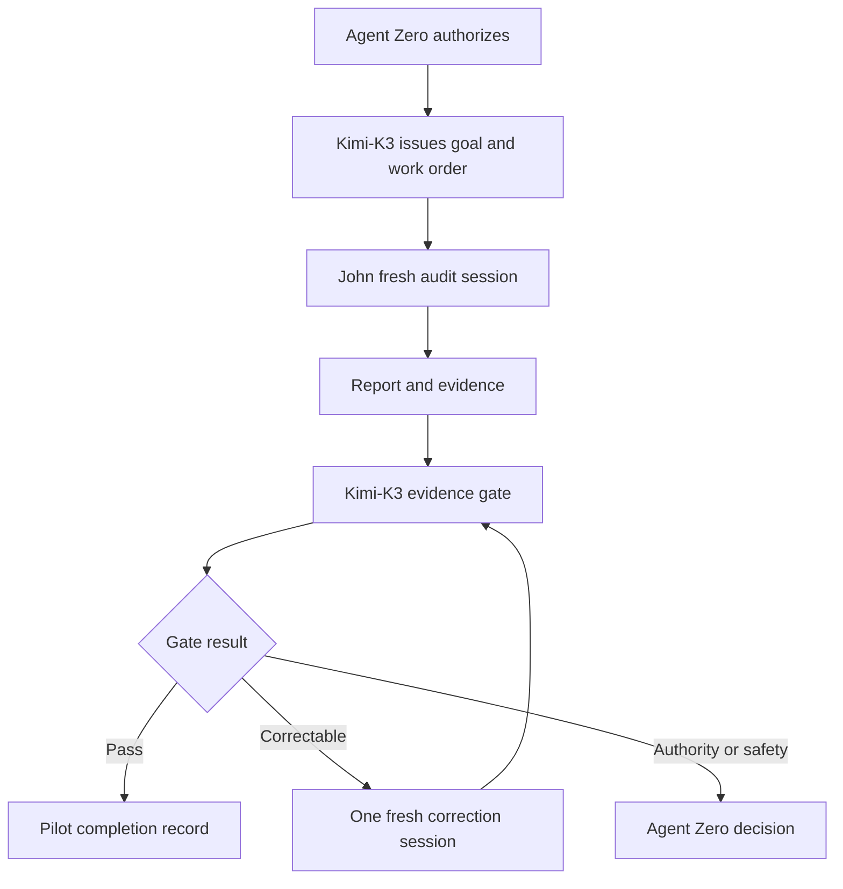

# Kimi-K3 and John Ollama Audit Process Pilot

## Document status

| Field | Value |
| --- | --- |
| Pilot ID | `PILOT-KK3-JOHN-OLLAMA-AUDIT-001` |
| Goal ID | `GOAL-OLLAMA-AUDIT-HXS5-001` |
| Goal file | `goals/2026-08-24-ollama-audit-hxs5.md` |
| Human authority | Agent Zero |
| Control plane | Kimi-K3 |
| Operational audit agent | John |
| Target host | `hxs-5` |
| Knowledge authority | `hxsa@hxs-5:/opt/tkv-local/ollama` |
| Execution mode | Strictly read-only and non-disruptive |
| Process under test | Goal-based, fresh-session, evidence-gated orchestration |
| Status | Ready for Agent Zero authorization |

## 1. Dual pilot objective

This pilot must produce two outcomes:

1. **Technical:** A reproducible, evidence-backed audit of the current Ollama runtime, hardware alignment, deployed-model configuration, network exposure, resource posture, and material performance risks on `hxs-5`, plus recommendation-only remediation guidance.
2. **Process:** Proof that Kimi-K3 commissioned, governed, and evaluated John through a bounded Goal Contract without performing operational work, and that John followed his knowledge-review, test-first, evidence, sanitization, and escalation requirements.

An audit report alone does not complete the pilot.

## 2. Absolute role separation

| Role | Owns | Prohibited |
| --- | --- | --- |
| Agent Zero | Goal, target, scope, human decisions, and risk authorization | Implicit or inferred approval |
| Kimi-K3 | Goal Contract, work order, context, budgets, state transitions, evidence gate, escalation, process learning | Connecting to `hxs-5`, running commands, creating host evidence, editing John’s audit findings, or executing remediation |
| John | Knowledge review, approved read-only inspection, technical analysis, audit report, and evidence package | Changing host state, expanding scope, hiding failures, or declaring factory acceptance |



Kimi-K3 evaluates only submitted control artifacts and evidence. Missing operational proof creates a new bounded evidence request or a blocked state—not permission for Kimi-K3 to obtain the proof directly.

### 2.1 Phase M execution note (KDD-0003)

During Phase M, John executes as a profile-briefed Kimi Code sub-agent: a fresh bounded session whose brief is John's profile, the work order, and the context packet, returning a structured result. The Kimi-K3 governor session runs no audit probes and connects to no host. Where this document states that Kimi-K3 performs zero operational work, it refers to the governor session under this dispatch model.

## 3. Authority and truth order

1. Explicit current instruction from Agent Zero
2. Current Kimi-K3 and John profiles
3. Current `hxsa@hxs-5:/opt/tkv-local/ollama` knowledge
4. Ratified HX governance and registries referenced there
5. Live read-only evidence from `hxs-5`
6. Source matching the exact installed Ollama version
7. Current official Ollama documentation when needed
8. Historical records, including KDD-028 and `hxs-4` material

KDD-028 is precedent only. It is not current `hxs-5` evidence. A conflict between current knowledge and live state must be preserved and escalated; John and Kimi-K3 may not silently choose a preferred source.

## 4. Goal Contract

```yaml
goal_contract:
  goal_id: "GOAL-OLLAMA-AUDIT-HXS5-001"
  version: 1
  outcome: >-
    Produce a sanitized, reproducible, evidence-backed assessment of current
    hxs-5 Ollama infrastructure, runtime, model residency, configuration,
    exposure, hardware fit, and material performance risks, plus
    recommendation-only remediation guidance, without changing host state.
  human_authority: "Agent Zero"
  target:
    host: "hxs-5"
    knowledge_source: "hxsa@hxs-5:/opt/tkv-local/ollama"
    service: "ollama"
  in_scope:
    - authoritative knowledge review
    - passive host, hardware, GPU, storage, service, endpoint, and log inspection
    - installed/running Ollama version reconciliation
    - pulled and loaded model inventory
    - model digest, context, quantization, and CPU/GPU residency assessment
    - passive capacity and performance-risk assessment
    - recommendation-only remediation plan
    - Kimi-K3-to-John process validation
  out_of_scope:
    - any configuration, file, package, model, network, or service mutation
    - restart, reload, process termination, reboot, or GPU reset
    - model pull, create, run, copy, unload, or deletion
    - active inference, stress, load, write-I/O, or saturation testing
    - driver, kernel, Ollama, or OS installation/upgrade
    - remediation execution
    - production model selection or fleet-role decisions
  success_conditions:
    - "SC-01: Knowledge Review Receipt precedes host audit execution."
    - "SC-02: Target and installed CLI, service binary, server, and relevant source identities are reconciled or explicitly unresolved and escalated."
    - "SC-03: Every mandatory audit vector is PASS, FAIL, BLOCKED, or NOT RUN with evidence and limitations."
    - "SC-04: Evidence is sanitized, timestamped, host-identified, and reproducible."
    - "SC-05: The report separates fact, authority, history, inference, and recommendation."
    - "SC-06: No prohibited mutation or disruptive operation occurs."
    - "SC-07: Recommendations trace to evidence, benefit, risk, prerequisites, validation, and rollback concepts."
    - "SC-08: Kimi-K3 records all state transitions and performs zero operational work."
    - "SC-09: The final gate reconciles report, command log, test matrix, evidence, and artifact hashes."
```

## 5. Budgets and convergence

| Control | Limit |
| --- | --- |
| Initial John execution | One fresh bounded session |
| Correction | Maximum one fresh correction session |
| Read-only command retry | Once, only for a plausibly transient safe failure |
| Operational concurrency | One agent: John |
| Host mutations | Zero |
| Active load/stress tests | Zero |
| Scope expansion | Requires Agent Zero |
| Kimi-K3 operational commands | Zero |

No unchanged action may be repeated. Failure to converge inside these limits requires escalation.

## 6. State machine

```text
RECEIVED
  -> AUTHORITY_VALIDATION
  -> GOAL_READY
  -> JOHN_KNOWLEDGE_REVIEW
  -> JOHN_AUDIT_EXECUTION
  -> EVIDENCE_SUBMITTED
  -> KIMI_K3_EVIDENCE_GATE
  -> PASSED
       -> PILOT_COMPLETE
  -> CORRECTION_AUTHORIZED
       -> JOHN_AUDIT_EXECUTION (one bounded correction session)
  -> FAILED
       -> PILOT_COMPLETE (FAIL)
  -> BLOCKED
       -> paused pending recorded human decision
  -> QUARANTINED
       -> terminal pending integrity resolution
```

| Transition | Required proof |
| --- | --- |
| `AUTHORITY_VALIDATION -> GOAL_READY` | Agent Zero accepts target, scope, budgets, and conditions |
| `GOAL_READY -> JOHN_KNOWLEDGE_REVIEW` | Versioned work order and context packet issued |
| `JOHN_KNOWLEDGE_REVIEW -> JOHN_AUDIT_EXECUTION` | Valid receipt with `Task May Proceed: YES`, and target peer address verified as 192.168.50.204 |
| `JOHN_AUDIT_EXECUTION -> EVIDENCE_SUBMITTED` | Report, test matrix, command log, evidence index, and validation summary submitted |
| `EVIDENCE_SUBMITTED -> KIMI_K3_EVIDENCE_GATE` | Artifact identities frozen for evaluation |
| `KIMI_K3_EVIDENCE_GATE -> PASSED` | All mandatory conditions proven |
| `KIMI_K3_EVIDENCE_GATE -> CORRECTION_AUTHORIZED` | Specific correctable defect and budget remains |
| `CORRECTION_AUTHORIZED -> JOHN_AUDIT_EXECUTION` | One bounded correction session with a fresh context packet and new session/context identifiers (sections 12 and 15) |
| `KIMI_K3_EVIDENCE_GATE -> FAILED` | A mandatory condition is unmet with no correction budget remaining, or the correction session fails; the gate record lists the failed conditions |
| Any state `-> BLOCKED` | Missing authority, access, knowledge, evidence, or human decision; the run pauses and resumes only on a recorded decision |
| Any state `-> QUARANTINED` | Mutation, secret exposure, artifact mismatch, or integrity concern; terminal pending integrity resolution |

Terminal semantics: `PASSED` reaches `PILOT_COMPLETE` with status `PASS — PILOT PROCESS AND AUDIT EVIDENCE VERIFIED`. `FAILED` reaches `PILOT_COMPLETE` with status `FAIL — PILOT OR AUDIT REQUIREMENTS NOT MET`. `BLOCKED` reaches `PILOT_COMPLETE` only after the required human decision is recorded, with status `BLOCKED — HUMAN DECISION REQUIRED`. `QUARANTINED` reaches `PILOT_COMPLETE` only with status `QUARANTINED — EVIDENCE OR GOVERNANCE INTEGRITY UNRESOLVED`. `CORRECTION_AUTHORIZED` is never a completion state; correctable results return through execution and the evidence gate.

No state may be skipped or inferred from narrative.

## 7. Kimi-K3 work order for John

```yaml
work_order:
  task_id: "WO-OLLAMA-AUDIT-HXS5-001"
  parent_goal: "GOAL-OLLAMA-AUDIT-HXS5-001"
  assigned_agent: "John"
  objective: "Conduct the authorized read-only hxs-5 audit and submit the complete sanitized evidence package."
  authoritative_inputs:
    - "John Expert Ollama Engineer Agent Profile"
    - "GOAL-OLLAMA-AUDIT-HXS5-001"
    - "hxsa@hxs-5:/opt/tkv-local/ollama"
  required_knowledge_review:
    - "Review all task-relevant authority, baselines, runbooks, tests, and blockers"
    - "Submit John's mandatory Knowledge Review Receipt"
  permitted_tools:
    - "SSH read-only session"
    - "passive Linux and systemd inspection"
    - "read-only Ollama CLI and local API queries"
    - "passive NVIDIA and journal inspection"
  prohibited_actions:
    - "all Goal Contract out-of-scope actions"
    - "any command whose side effects are uncertain"
  deliverables:
    - "knowledge review receipt"
    - "audit test plan and matrix"
    - "host/runtime snapshot"
    - "sequential sanitized command log"
    - "structured audit report"
    - "evidence index and hashes"
    - "John validation summary"
  escalation_target: "Kimi-K3"
```

## 8. Context packet

Kimi-K3 provides only the Goal Contract, work order, John’s profile, target/knowledge path, audit matrix, relevant Agent Zero decisions, output schemas, and evidence-destination rules.

Do not provide unrelated factory conversations, credentials, unfiltered historical corpora, or Kimi-K3 internal reasoning. Historical `hxs-4` findings may be supplied only as clearly labeled precedent after current `hxs-5` truth is reconstructed.

## 9. Mandatory knowledge-review gate

Before audit probes, John must complete his startup protocol and submit:

```text
[KNOWLEDGE REVIEW COMPLETE]
Host: hxs-5
Source: /opt/tkv-local/ollama
Reviewed At: <ISO-8601 timestamp>
Relevant Files: <count and paths>
Authority/Version Identified: <value or NOT ESTABLISHED>
Applicable Tests/Runbooks: <paths>
Contradictions or Gaps: <none or details>
Task May Proceed: YES | NO
```

`Task May Proceed: NO` moves the pilot to `BLOCKED`. Historical evidence or model memory cannot substitute for this gate.

## 10. Mandatory audit matrix

John must define the expected result for every test from current authoritative knowledge before execution. Commands below are permitted examples, not instructions to run an unsafe or inapplicable probe.

Every test status is `PASS`, `FAIL`, `BLOCKED`, or `NOT RUN`.

### 10.1 Identity and host baseline

| ID | Property | Example passive probes | Evidence |
| --- | --- | --- | --- |
| ID-01 | Target and time | `hostnamectl`, `hostname`, `date --iso-8601=seconds`; record the session's SSH destination or peer address (for example `echo $SSH_CONNECTION` or `who am i`) and compare it with `192.168.50.204` before any further probe | Hostname, timestamp, and verified peer address; a peer-address mismatch aborts the session even when the hostname matches |
| ID-02 | OS/kernel | `cat /etc/os-release`, `uname -a` | Relevant complete output |
| ID-03 | Resource baseline | `uptime`, `free -h`, `swapon --show`, `df -hT` | Current snapshot |
| ID-04 | Ollama identities | `command -v ollama`, `ollama --version`, systemd `ExecStart`, `/api/version` | CLI, serving binary, server, and source reconciliation |

### 10.2 CPU, memory, NUMA, and storage

| ID | Property | Example passive probes | Evidence |
| --- | --- | --- | --- |
| HW-01 | CPU topology | `lscpu` | Sockets, cores, threads, architecture |
| HW-02 | NUMA | `lscpu`; `numactl --hardware` only if installed | Node and memory distribution; install nothing |
| HW-03 | RAM/swap | `free -h`, `swapon --show`, `/proc/meminfo` | Total/current state |
| HW-04 | Model storage | Effective `OLLAMA_MODELS`, `findmnt`, `lsblk -o NAME,TYPE,SIZE,FSTYPE,MOUNTPOINTS,ROTA,MODEL`, `df -hT` | Path, medium, filesystem, capacity |
| HW-05 | Storage performance | Existing authoritative benchmarks/passive telemetry | No `fio`, writes, cache dropping, or saturation; use `NOT ESTABLISHED` if absent |

### 10.3 GPU and accelerator

| ID | Property | Example passive probes | Evidence |
| --- | --- | --- | --- |
| GPU-01 | Inventory/driver | `nvidia-smi -L`, `nvidia-smi` | GPU count/model, VRAM, driver, utilization, temperature |
| GPU-02 | Topology/processes | `nvidia-smi topo -m`, supported one-shot process query | Topology and active processes |
| GPU-03 | Driver health | Bounded filtered kernel/Ollama journals | Xid, NVRM, OOM, fallback indicators |
| GPU-04 | Isolation | Effective service configuration | Backend visibility and `CUDA_VISIBLE_DEVICES` with secrets redacted |

### 10.4 Ollama service and effective configuration

| ID | Property | Example passive probes | Evidence |
| --- | --- | --- | --- |
| SVC-01 | Unit/state | `systemctl status ollama --no-pager`, `systemctl cat ollama` | Fragment, drop-ins, identity, state |
| SVC-02 | Runtime wiring | `systemctl show ollama -p ExecStart -p User -p Group -p Environment -p FragmentPath -p DropInPaths` | Effective sanitized values |
| SVC-03 | Listener | `ss -lntp`, effective `OLLAMA_HOST` | Addresses, port, process |
| SVC-04 | Tuning | Inspect parallelism, loaded models, queue, context, FlashAttention, KV cache, keep-alive, backend, proxy, cloud, debug, origins | Value or `NOT SET`, plus source |
| SVC-05 | Service health | Bounded `journalctl -u ollama` | Errors, restarts, OOM/fallback; sanitize request content |

### 10.5 API and models

| ID | Property | Example passive probes | Evidence |
| --- | --- | --- | --- |
| API-01 | Local server | Bounded `/api/version` query | Status, body, timing |
| API-02 | Pulled inventory | `/api/tags`, `ollama list` | Names, tags, digests, sizes |
| API-03 | Loaded inventory | `/api/ps`, `ollama ps` | Loaded models, context, residency/processor split |
| MOD-01 | Identity/quantization | API/CLI plus approved manifest/Modelfile | Digest, quantization, size, provenance |
| MOD-02 | Context alignment | Effective context versus approved workload/hardware target | Current/target/gap and expected memory effect |
| MOD-03 | Offload/residency | `/api/ps`, `ollama ps`, passive GPU evidence, logs | Actual GPU/CPU residency; model presence is insufficient |

### 10.6 Network and security

| ID | Property | Example passive probes | Evidence |
| --- | --- | --- | --- |
| SEC-01 | Exposure | Listener, `OLLAMA_HOST`, governing authority | Loopback/LAN state and compliance |
| SEC-02 | Proxy/auth boundary | Approved proxy/service configuration | Actual protection or `NOT ESTABLISHED` |
| SEC-03 | Permissions | `stat`, `namei -l`, service identity | Model-store/service ownership and permissions |
| SEC-04 | Secret hygiene | Sanitized environment/unit/log inspection | No secret values retained; exposure escalated |

### 10.7 Passive performance assessment

No new inference load or sustained benchmark is authorized. John may analyze existing approved benchmarks, passive snapshots, existing Ollama timing metadata, model size/context/quantization/residency, and logs showing queueing, OOM, fallback, unload/reload, or timeouts.

Without comparable evidence, conclusions must be `NOT ESTABLISHED` or `CAPACITY INFERENCE — VALIDATION REQUIRED`. A separate benchmark pilot may be recommended but not executed.

## 11. Read-only guardrails

John must not run:

- `systemctl restart|stop|start|reload|enable|disable|edit`;
- `kill`, `pkill`, or equivalents;
- `ollama pull|rm|create|cp|run|stop`;
- installers or package managers;
- commands writing service, system, model, network, firewall, or proxy state;
- `fio`, stress tools, cache-dropping, destructive disk commands, or load generators;
- reboot, shutdown, driver reload, or GPU reset;
- any command with uncertain side effects.

If an approved-looking probe unexpectedly mutates or degrades state, John stops, preserves evidence, avoids self-remediation, and escalates. Kimi-K3 quarantines the branch and notifies Agent Zero.

## 12. Evidence package

The designated evidence root for this pilot is `pilots/PILOT-KK3-JOHN-OLLAMA-AUDIT-001/` (KDD-0003). The structure below is created inside it; no separate authority location is invented.

```text
pilots/PILOT-KK3-JOHN-OLLAMA-AUDIT-001/
├── 00-intent-and-authority-receipt.md
├── 01-kimi-k3-work-order.yaml
├── 02a-context-packet-initial.yaml
├── 02b-context-packet-correction.yaml   (created only if a correction session is authorized)
├── 03-john-knowledge-review-receipt.md
├── 04-audit-test-plan.md
├── 05-command-log.md
├── 06-raw-evidence-sanitized/
├── 07-audit-report.md
├── 08-john-validation-summary.md
├── 09-kimi-k3-state-log.md
├── 10-kimi-k3-quality-gate-decision.md
├── 11-pilot-completion-record.md
├── 12-process-learning-record.md
└── sha256sums.txt
```

Each context manifest records its session ID and context hash. Every artifact above, including the state log, is hashed into `sha256sums.txt`. The state log records every HFSM transition in order with timestamp and proof reference, providing the durable record SC-08 and PROC-06 require.

### 12.1 Command log

| Sequence | Timestamp | Executor role | Session ID | Context hash | Work-order hash | Correction session | User/Host | Directory | Test ID | Sanitized command | Exit | Evidence path |
| ---: | --- | --- | --- | --- | --- | --- | --- | --- | --- | ---: | --- |

Executor role is `governor` (Kimi-K3 control actions) or `john` (operational probes); the correction-session column holds `initial` or `correction-1`. Together with session ID and context hash, the log distinguishes governor from John and proves each session was fresh and bounded.

Record every attempt, failure, timeout, and unexecuted test, in the initial session and in any correction session.

### 12.2 Sanitization

Redact passwords, tokens, keys, cookies, authorization headers, credential URLs, sensitive environment values, production prompts/requests, and unrelated user data. Retain safe variable names and replace values with `REDACTED`. Secret discovery requires immediate escalation without reproducing the secret.

## 13. Required John audit report

John must provide:

1. **Executive verdict:** status, target/time, top verified findings, unknowns, decision needs, and explicit no-change statement.
2. **Authority and provenance:** goal/work-order versions, knowledge receipt/files, live evidence period, installed/server/source identities, contradictions, historical precedent.
3. **Host/runtime snapshot:** CPU, NUMA, RAM/swap, GPU/VRAM/driver, storage, service identity, listener, effective sanitized configuration, model inventory/residency.
4. **Audit test matrix:**

| Test ID | Property | Expected | Actual | Status | Evidence | Limitation |
| --- | --- | --- | --- | --- | --- | --- |

5. **Gap analysis:**

| Finding | Component | Observed | Controlling target | Gap | Severity | Impact | Evidence | Confidence |
| --- | --- | --- | --- | --- | --- | --- | --- | --- |

6. **Model/hardware alignment:** tag, digest, quantization, size, context, load state, residency, passive footprint, approved workload target, implications, limitations.
7. **Network/security assessment:** listener, authorized exposure, proxy/auth boundary, service identity, permissions, origin posture, secret hygiene.
8. **Recommendation-only remediation plan:**

| ID | Finding | Proposed change | Benefit | Risk | Prerequisite/authority | Validation | Rollback concept | Priority |
| --- | --- | --- | --- | --- | --- | --- | --- | --- |

Any command/snippet must appear beneath `RECOMMENDATION ONLY — NOT AUTHORIZED FOR EXECUTION`. It must be version-matched, reversible, and evidenced. Otherwise provide intent only and label it `VALIDATION REQUIRED`.

9. **Remaining gaps/decisions:** separate blockers, Agent Zero decisions, future validation, deferred work, and observations.
10. **John validation summary:** tested/not-run state, fact versus inference, mutation status, artifact hashes, risks, and exact decisions.

John’s allowed completion states:

- `PASS — AUDIT EVIDENCE PACKAGE COMPLETE`
- `FAIL — AUDIT INCOMPLETE`
- `BLOCKED — ESCALATED TO KIMI-K3`

John does not declare the pilot accepted.

## 14. Kimi-K3 evidence gate

Kimi-K3 must confirm:

- authority and Goal Contract version preceded work;
- work order/context preceded John’s session;
- knowledge receipt preceded audit probes;
- target is consistently `hxs-5`;
- every test has a status and evidence;
- commands remain read-only;
- failures and `NOT RUN` items are visible;
- report claims trace to admissible evidence;
- `hxs-4` history is not current truth;
- Ollama CLI, service binary, server, and source identities reconcile or remain explicitly unresolved;
- pulled model presence is not substituted for loaded residency;
- performance is not claimed without adequate evidence;
- recommendations were not executed;
- sanitization and hashes reconcile;
- budgets/state transitions were respected;
- Kimi-K3 performed zero operational work.

```text
[QUALITY GATE DECISION]
Gate ID: GATE-PILOT-KK3-JOHN-001
Goal ID/Version:
Work Order:
Artifact Identities/Hashes:
Success Conditions:
Evidence Reviewed:
Result: PASS | FAIL | BLOCKED | QUARANTINED
Failed/Unexecuted Requirements:
Contradictions:
Residual Risk:
Control-Plane Boundary Preserved: YES | NO
Authorized Transition:
Decision Timestamp:
```

Kimi-K3 may authorize one fresh correction session for a correctable report/evidence-packaging defect. It may not request manufactured evidence, hidden failures, or remediation execution.

## 15. Process acceptance matrix

| ID | Property | Pass condition | Evidence |
| --- | --- | --- | --- |
| PROC-01 | Authority first | Agent Zero authorization and Goal Contract precede work | Receipt/timestamps |
| PROC-02 | Plane separation | Kimi-K3 executes no operational command | State/work-order history |
| PROC-03 | Knowledge first | John’s receipt precedes audit probes | Receipt/command timestamps |
| PROC-04 | Fresh bounded execution | Initial and any correction sessions have distinct context manifests (`02a`/`02b`) with separate session IDs and context hashes | Session/context manifests |
| PROC-05 | Minimum context | Only task-relevant versioned inputs supplied | Context manifests `02a`/`02b` |
| PROC-06 | Durable state | Every HFSM transition recorded | State log |
| PROC-07 | Evidence over assertion | Every accepted claim maps to evidence | Traceability matrix |
| PROC-08 | Convergence | Retry/correction limits honored | Budget ledger |
| PROC-09 | Fail closed | Missing authority/state/evidence pauses or fails | Escalation/gate record |
| PROC-10 | Reproducibility | Reviewer can reconstruct decisions | Package and hashes |

### 15.1 Pilot limitation

This two-agent pilot validates Kimi-K3’s control-plane gate and John’s evidence discipline. It does not supply a second Ollama specialist’s independent opinion. Subjective optimization recommendations or disputed interpretations not settled by deterministic evidence remain `VALIDATION REQUIRED`.

## 16. Stop and escalation

John stops for access failure, hostname mismatch, authority/version conflict, unsafe command, failed mandatory test, unexpected state, secret exposure, possible harm, need for mutation/load testing, or missing evidence.

Kimi-K3 stops for authority ambiguity, scope expansion, governance breach, exhausted correction budget, unresolved knowledge/live contradiction, risk acceptance, evidence-integrity concern, or pressure to perform operational work.

## 17. Pilot completion record

```text
[PILOT COMPLETION RECORD]
Pilot ID:
Goal ID/Version:
Agent Zero Authority:
John Session(s):
Kimi-K3 State Transitions:
Technical Audit Status:
Process Acceptance Matrix:
Evidence Package Identity/Hash:
Failed/Blocked/Not-Run Tests:
Control-Plane Boundary Preserved:
Host Mutation Detected:
Correction/Retry Budget Used:
Residual Risks:
Human Decisions Required:
Process Learning Findings:
Final Status:
```

Allowed final statuses:

- `PASS — PILOT PROCESS AND AUDIT EVIDENCE VERIFIED`
- `FAIL — PILOT OR AUDIT REQUIREMENTS NOT MET`
- `BLOCKED — HUMAN DECISION REQUIRED`
- `QUARANTINED — EVIDENCE OR GOVERNANCE INTEGRITY UNRESOLVED`

## 18. Process Learning Record

Kimi-K3 records session/retry counts, elapsed time and available cost telemetry, John’s first-pass completeness, missing/excess context, blocked/unexecuted tests, ambiguous claims, boundary pressure, recommended process/profile/template changes, ratification needs, and the next pilot hypothesis.

Kimi-K3 may propose improvements but may not silently modify agent constitutions, authority, or safety gates.

## 19. Agent Zero readiness gate

Execution requires **yes** to all:

- Is `hxs-5` the intended target?
- Is `/opt/tkv-local/ollama` available as current knowledge authority?
- Are the current Kimi-K3 and John profiles governing?
- Is the Goal Contract accepted without remediation authority?
- Is execution strictly read-only and non-disruptive?
- Are active inference, storage, stress, restart, and configuration tests excluded?
- Is the evidence root accepted as `pilots/PILOT-KK3-JOHN-OLLAMA-AUDIT-001/` (section 12)?
- Are the one-session, one-correction, and one-transient-retry limits accepted?
- Will the Kimi-K3 governor session run no audit probes and create no missing evidence, with John executed as a profile-briefed sub-agent (section 2.1)?
- Will unsupported technical recommendations remain `VALIDATION REQUIRED`?
- Are final states and escalations accepted?

If any answer is no:

`BLOCKED — AGENT ZERO CLARIFICATION REQUIRED`

## 20. Standing directive

> This pilot succeeds only if it produces both a defensible Ollama audit and proof that Kimi-K3 governed John through a bounded, fresh-session, evidence-gated process without crossing into operational execution.
